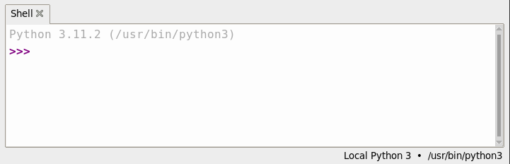

# Introdução à MicroPython com Raspberry Pi Pico

Bem vindo!
Você associa computadores àquelas máquinas que ficam na sua mesa e você digita nelas? Isso certamente é um tipo de computador, mas não é o único. Neste curso, estamos explorando microcontroladores - pequenas unidades de processamento com menos memória, especializadas em controlar outros dispositivos. 

Com certeza você já tem vários microcontroladores em casa. A sua TV, por exemplo, muito provavelmente é controlada por um microcontrolador; o mesmo pode ocorrer com a sua máquina de café ou no micro-ondas. É claro que todos esses microcontroladores já vêm com seus próprios programas e os fabricantes tornam difícil alterar o software que está rodando neles.

Por outro lado, um Raspberry Pi Pico pode ser facilmente reprogramado através de uma conexão USB. Neste curso vamos aprender como utilizar esse hardware e como trabalhar com outros componentes eletrônicos. Ao final desta jornada, você terá a habilidade de criar suas próprias invenções eletrônicas programáveis. O que você fará com elas dependerá apenas de sua criatividade!

## O que é Raspberry Pi Pico?
O Raspberry Pi Pico é uma maravilha em miniatura, colocando a mesma tecnologia que sustenta desde sistemas de casa inteligente até fábricas industriais na palma da sua mão. Esteja você interessado em aprender sobre a linguagem de programação MicroPython, dando os primeiros passos na computação física, ou deseja construir um projeto de hardware, o Raspberry Pi Pico pode lhe apoiar em cada etapa do caminho.

O Raspberry Pi Pico é conhecido como uma placa de desenvolvimento de microcontrolador, o que significa simplesmente que é uma placa de circuito impresso que abriga um tipo especial de processador projetado para contato com o mundo físico: o microcontrolador. Do tamanho de um pedaço de goma de mascar, o Raspberry Pi Pico possui uma surpreendente quantidade de potência graças ao chip no centro da placa: um microcontrolador RP2040.

O Raspberry Pi Pico não foi projetado para substituir o computador que você tem em casa, que pertence a uma classe diferente de dispositivo conhecido como computador pessoal ou Personal Computer (PC) em inglês. Enquanto você pode usar o seu PC para jogar jogos, escrever histórias e navegar na web, o Raspberry Pi Pico foi projetado para projetos de computação física onde ele controla desde LEDs e botões até sensores, motores e até mesmo outros microcontroladores. 

Ao longo deste curso, você aprenderá tudo sobre o Raspberry Pi Pico, mas as habilidades que você adquirir também se aplicarão a qualquer outra placa de desenvolvimento baseada no microcontrolador RP2040, e até mesmo a outros dispositivos, contanto que sejam compatíveis com a linguagem de programação MicroPython.

## Conhecendo o Raspberry Pi Pico
O Raspberry Pi Pico é um dispositivo muito compacto. Apesar disso, ele inclui uma série de recursos, todos acessíveis pelos pinos ao redor da borda da placa. Se você observar as bordas mais longas, verá seções de cor dourada. Esses são os pinos que fornecem ao microcontrolador RP2040 conexões com o mundo exterior, conhecidos como entrada/saída, ou Input/Output (I/O) em inglês.


O chip no centro do seu Pico é um microcontrolador RP2040. Este é um circuito integrado personalizado (CI), projetado e construído especificamente pelos engenheiros para dar poder computacional ao seu Pico e outros dispositivos baseados em microcontrolador. Se você olhar para ele contra a luz, verá um logotipo da Raspberry Pi gravado na parte superior do chip, juntamente com uma série de letras e números que permitem aos engenheiros rastrear quando e onde o chip foi fabricado.

Na parte superior do seu Pico há uma porta micro USB. Ela fornece energia para o funcionamento do seu Pico e também permite que o Pico se comunique com o seu Raspberry Pi ou outro computador através da sua porta USB - é assim que você vai carregar seus programas no seu Pico. Se você segurar o seu Pico e olhar para a porta micro USB de frente, verá que ela tem a forma de ser mais estreita na parte inferior e mais larga na parte superior. Pegue um cabo micro USB e você verá que o conector é o mesmo.

> `Atenção`: O cabo micro USB só se encaixará na porta micro USB do seu Pico de uma maneira. Ao conectá-lo, certifique-se de alinhar os lados estreito e largo da maneira correta - ou você pode danificar o seu Pico ao tentar forçar o cabo micro USB na direção errada!

Logo abaixo da porta micro USB há um pequeno botão marcado como BOOTSEL. BOOTSEL é a abreviação de 'seleção de inicialização', que alterna o seu Pico entre dois modos de inicialização quando é ligado pela primeira vez. Você usará o botão de seleção de inicialização mais tarde, à medida que prepara o seu Pico para a programação com MicroPython.

Na parte inferior do seu Pico, há três pequenos pads dourados com a palavra 'DEBUG' acima deles. Eles são projetados para depuração, ou seja, encontrar erros, em programas em execução no Pico, usando uma ferramenta especial chamada debugger. Você não fará depuração de código de programas neste curso, mas pode achá-lo útil à medida que escreve programas maiores e mais complicados.

Vire o seu Pico e você verá que a parte inferior tem escritos rotulando cada um dos pinos com sua função principal. Você verá coisas como 'GP0' e 'GP1', 'GND', 'RUN' e '3V3'. Se você esquecer qual pino é qual, esses rótulos irão te ajudar. Mas você não poderá vê-los quando o Pico estiver inserido em uma placa de prototipagem (breadboard). Por isso você pode consultar o diagrama que segue para facilitar a referência sempre que necessário.


Se você tiver uma placa de prototipagem, insira o seu Raspberry Pi Pico na placa. Posicione-o de forma que os dois conectores estejam separados pelo vão no meio conforme a figura a seguir.


> `Nota`: Insira o Pico com o conector micro USB posicionado para o canto da placa de prototipagem conforme a figura. Isso facilitará a conexão do cabo micro USB.

Agora conecte o seu cabo micro USB à porta localizada no lado esquerdo do Pico.


> `Atenção`: Seja gentil ao conectar o cabo micro USB ao seu Pico. O conector do Pico é frágil e pode danificar facilmente. Após fixar o cabo, evite retirá-lo com frequência.

## Programando com MicroPython
Desde o seu lançamento em 1991, a linguagem de programação Python, nomeada após o famosa série de televisão Monty Python, em vez da serpente, cresceu para se tornar uma das mais populares no mundo. Sua popularidade, no entanto, não significa que não haja melhorias que possam ser feitas especialmente se você estiver trabalhando com um microcontrolador. 

A linguagem de programação Python foi desenvolvida para sistemas de computador como desktops, laptops e servidores. Placas de microcontrolador como o Raspberry Pi Pico são menores, mais simples e têm consideravelmente menos memória, o que significa que não conseguem executar a mesma linguagem Python que seus equivalentes maiores. 

É aqui que o MicroPython entra em cena. Originalmente desenvolvido por Damien George e lançado pela primeira vez em 2014, o MicroPython é uma linguagem de programação compatível com Python desenvolvida especificamente para microcontroladores. Ele inclui muitas das características do Python convencional, enquanto adiciona uma variedade de novas funcionalidades projetadas para aproveitar as facilidades disponíveis no Raspberry Pi Pico e em outras placas de microcontrolador. Se você já programou em Python antes, encontrará o MicroPython imediatamente familiar. Se não, não se preocupe: é uma linguagem fácil de aprender!

## Thonny Python IDE
O Thonny é um ambiente de desenvolvimento integrado (IDE) para a linguagem de programação Python. Ele é projetado especialmente para iniciantes e estudantes de programação. O Thonny oferece uma interface de usuário simples e intuitiva, o que o torna mais fácil de usar para aqueles que estão aprendendo a programar em Python.

Algumas das características do Thonny incluem:
* `Editor de código`: possui um editor de código com destaque de sintaxe, sugestões de código e outras funcionalidades para facilitar a escrita de código Python.
* `Shell integrado`: possui um shell Python integrado, permitindo que os usuários testem rapidamente pequenos trechos de código sem a necessidade de criar um módulo Python separado.
* `Depurador simples`: oferece funcionalidades de depuração para ajudar a identificar e corrigir erros no código.
* `Explorador de variáveis`: permite visualizar o estado das variáveis durante a execução do programa.
* `Gerenciador de pacotes integrado`: Facilita a instalação e gerenciamento de bibliotecas e pacotes Python.
* `Suporte a placas microcontroladoras`: Thonny é compatível com microcontroladores como o Raspberry Pi Pico, o que facilita a programação de dispositivos embarcados.

No geral, o Thonny é uma escolha popular para iniciantes em Python devido à sua interface amigável e às ferramentas úteis que oferece para facilitar o aprendizado da linguagem de programação e de desevolvimento de sistemas computação física.

A seguir você irá instalar o Thonny, irá se conectar ao seu Raspberry Pi Pico e também executar um código Python simples usando o Shell.

## Instalando o Thonny Python IDE
Você pode instalar a versão mais recente do Thonny IDE no Windows, macOS e Linux, ou seja, o Thonny está presente em todas as plataformas. Em um navegador da web, acesse [thonny.org](https://thonny.org/). No canto superior direito da janela do navegador, você verá os links de download para Windows e macOS, além das instruções para Linux. Siga as instruções apresentadas de acordo com o seu sistema operacional para instalar o Thonny.


O Thonny Python IDE vem pré-instalado com o suporte para MicroPython. Portanto, quando você instalar o Thonny, já terá a capacidade de programar em MicroPython sem a necessidade de instalar nenhum pacote adicional. 

Agora abra o Thony IDE a partir do seu iniciador de aplicativos e você será apresentado sua a tela principal. 


Você pode usar o Thonny para escrever código Python padrão. Digite o seguinte na janela principal e depois clique no botão Run.

```
print('Hello World!')
```

Não é necessário entender esse código nesse momento. Utilizamos esse procedimento apenas para testar o seu ambiente e garantir que a instalação do Thonny tenha sido bem sucedida. Caso não obtenha o resultado como na figura que segue, repita os procedimentos anteriores.


## Adicione o firmware MicroPython
Se você nunca utilizou o MicroPython no seu Raspberry Pi Pico, será necessário adicionar o firmware do MicroPython.
Primeiramente confirme que cabo micro USB está conectado na porta micro USB do seu Pico.

Agora encontre o botão `BOOTSEL` no seu Raspberry Pi Pico.


Pressione o botão `BOOTSEL` e mantenha-o pressionado enquanto conecta a outra ponta do cabo micro USB ao seu computador. Uma imagem de um Raspberry Pi é mostrada a seguir, mas o mesmo se aplica a qualquer computador.


Após conectar o cabo micro USB ao seu computador, solte o botão `BOOTSEL`. Isso coloca o seu Raspberry Pi Pico no modo de dispositivo de armazenamento em massa USB.

> `Atenção`: Fique atento a sequência de instruções acima. O botão `BOOTSEL` deve estar pressionado enquanto se conecta o cabo micro USB ao computador, e logo em seguida liberado.

Na parte inferior direita da janela do Thonny, você verá a versão do Python que está atualmente em uso.


Clique na versão do Python e escolha 'MicroPython (Raspberry Pi Pico)'.


Se você não vê esta opção, verifique se você conectou o seu Raspberry Pi Pico corretamente. Se tudo correr bem, uma caixa de diálogo irá aparecer para instalar a versão mais recente do firmware MicroPython no seu Raspberry Pi Pico.


Clique no botão `Install` para gravar o firmware no seu Raspberry Pi Pico.
Aguarde a instalação ser concluída e clique em `Close`.

> `Nota`: Você não precisa atualizar o firmware toda vez que usar o seu Raspberry Pi Pico. Da próxima vez, você pode simplesmente conectá-lo ao seu computador sem pressionar o botão `BOOTSEL`.

## Usando o Shell
Olhe para o painel do Shell na parte inferior do editor Thonny.

Você deverá ver algo assim:




