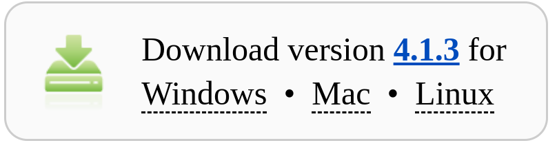
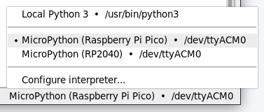

# Introdução à MicroPython com Raspberry Pi Pico

Bem vindo!
Você associa computadores àquelas máquinas que ficam na sua mesa e você digita nelas? Isso certamente é um tipo de computador, mas não é o único. Neste curso, estamos explorando microcontroladores - pequenas unidades de processamento com menos memória, especializadas em controlar outros dispositivos. 

Com certeza você já tem vários microcontroladores em casa. A sua TV, por exemplo, muito provavelmente é controlada por um microcontrolador; o mesmo pode ocorrer com a sua máquina de café ou no micro-ondas. É claro que todos esses microcontroladores já vêm com seus próprios programas e os fabricantes tornam difícil alterar o software que está rodando neles.

Por outro lado, um Raspberry Pi Pico pode ser facilmente reprogramado através de uma conexão USB. Neste curso vamos aprender como utilizar esse hardware e como trabalhar com outros componentes eletrônicos. Ao final desta jornada, você terá a habilidade de criar suas próprias invenções eletrônicas programáveis. O que você fará com elas dependerá apenas de sua criatividade!

## O que é Raspberry Pi Pico?
O Raspberry Pi Pico é uma maravilha em miniatura, colocando a mesma tecnologia que sustenta desde sistemas de casa inteligente até fábricas industriais na palma da sua mão. Esteja você interessado em aprender sobre a linguagem de programação MicroPython, dando os primeiros passos na computação física, ou deseja construir um projeto de hardware, o Raspberry Pi Pico pode lhe apoiar em cada etapa do caminho.

O Raspberry Pi Pico é conhecido como uma placa de desenvolvimento de microcontrolador, o que significa simplesmente que é uma placa de circuito impresso que abriga um tipo especial de processador projetado para contato com o mundo físico: o microcontrolador. Do tamanho de um pedaço de goma de mascar, o Raspberry Pi Pico possui uma surpreendente quantidade de potência graças ao chip no centro da placa: um microcontrolador RP2040.

O Raspberry Pi Pico não foi projetado para substituir o computador que você tem em casa, que pertence a uma classe diferente de dispositivo conhecido como computador pessoal ou _Personal Computer_ (PC) em inglês. Enquanto você pode usar o seu PC para jogar jogos, escrever histórias e navegar na web, o Raspberry Pi Pico foi projetado para projetos de computação física onde ele controla desde LEDs e botões até sensores, motores e até mesmo outros microcontroladores. 

Ao longo deste curso, você aprenderá tudo sobre o Raspberry Pi Pico, mas as habilidades que você adquirir também se aplicarão a qualquer outra placa de desenvolvimento baseada no microcontrolador RP2040, e até mesmo a outros dispositivos, contanto que sejam compatíveis com a linguagem de programação MicroPython.

## Conhecendo o Raspberry Pi Pico
O Raspberry Pi Pico é um dispositivo muito compacto. Apesar disso, ele inclui uma série de recursos, todos acessíveis pelos pinos ao redor da borda da placa. Se você observar as bordas mais longas, verá seções de cor dourada. Esses são os pinos que fornecem ao microcontrolador RP2040 conexões com o mundo exterior, conhecidos como entrada/saída, ou _Input/Output_ (I/O) em inglês.


O chip no centro do seu Pico é um microcontrolador RP2040. Este é um Circuito Integrado (CI) personalizado, projetado e construído especificamente pelos engenheiros para dar poder computacional ao seu Pico e outros dispositivos baseados em microcontrolador. Se você olhar para ele contra a luz, verá um logotipo da Raspberry Pi gravado na parte superior do chip, juntamente com uma série de letras e números que permitem aos engenheiros rastrear quando e onde o chip foi fabricado.

Na parte superior do seu Pico há uma porta micro USB. Ela fornece energia para o funcionamento do seu Pico e também permite que o Pico se comunique com um computador através da sua porta USB, o que permite carregar seus programas no seu Pico. Se você segurar o seu Pico e olhar para a porta micro USB de frente, verá que ela é mais estreita na parte inferior e mais larga na parte superior. Pegue um cabo micro USB e você verá que o conector tem a mesma forma.

> **`Atenção`**: O cabo micro USB só se encaixará na porta micro USB do seu Pico de uma maneira. Ao conectá-lo, certifique-se de alinhar os lados estreito e largo da maneira correta ou você pode danificar o seu Pico ao tentar forçar o cabo micro USB na direção errada!

Logo abaixo da porta micro USB há um pequeno botão marcado como `BOOTSEL` que alterna entre dois modos de inicialização quando seu Pico é ligado pela primeira vez. Você usará o botão de seleção de inicialização mais tarde, à medida que prepara o seu Pico para a programação com MicroPython.

Na parte inferior do seu Pico, há três pequenos pinos dourados com a palavra **DEBUG** acima deles. Eles são projetados para depuração, ou seja, encontrar erros em programas em execução no Pico, usando uma ferramenta especial chamada debugger. Você não fará esse tipo de depuração de código de programas neste curso, mas pode achá-lo útil à medida que escreve programas maiores e mais complicados.

Vire o seu Pico e você verá que a parte inferior tem escritos rotulando cada um dos pinos com sua função principal. Você verá coisas como **GP0** e **GP1**, **GND**, **RUN** e **3V3**. Se você esquecer qual pino é qual, esses rótulos irão te ajudar. Mas você não poderá vê-los quando o Pico estiver inserido em uma placa de prototipagem (_breadboard_). Por isso você pode consultar o diagrama que segue para facilitar a referência sempre que necessário.


Se você tiver uma placa de prototipagem, insira o seu Raspberry Pi Pico na placa de forma que ele cubra a divisão do meio e a porta micro USB esteja no topo da placa, conforme a figura que segue. Empurre delicadamente o Pico para baixo até que as partes plásticas dos pinos estejam tocando a placa de prototipagem. Isso significa que as partes metálicas dos pinos estão totalmente inseridas e fazendo um bom contato elétrico com a placa de prototipagem.

O pino superior esquerdo, **GP0**, deve estar na fileira marcada com um **1**, se sua placa de prototipagem estiver numerada (algumas placas iniciam pelo valor **0**). Antes de empurrar o seu Pico para baixo, certifique-se de que os pinos estejam todos devidamente posicionados. Se você dobrar um pino, pode ser difícil endireitá-lo novamente sem quebrá-lo.


> **`Dica`**: Insira o Pico com o conector micro USB posicionado para o topo da placa de prototipagem conforme a figura. Isso facilitará a conexão do cabo micro USB posteriormente.

Agora conecte o seu cabo micro USB à porta localizada no lado esquerdo do Pico.


> **`Atenção`**: Seja gentil ao conectar o cabo micro USB ao seu Pico. O conector do Pico é frágil e pode danificar facilmente. Após fixar o cabo, evite retirá-lo com frequência.

## Programando com MicroPython
Desde o seu lançamento em 1991, a linguagem de programação Python, nomeada após a famosa série de televisão **Monty Python**, cresceu para se tornar uma das mais populares no mundo. Sua popularidade, no entanto, não significa que não haja melhorias que possam ser feitas especialmente se você estiver trabalhando com um microcontrolador. 

A linguagem de programação Python foi desenvolvida para sistemas de computador como desktops, laptops e servidores. Placas de microcontrolador como o Raspberry Pi Pico são menores, mais simples e têm consideravelmente menos memória, o que significa que não conseguem executar a mesma linguagem Python que seus equivalentes maiores.

É aqui que o MicroPython entra em cena. Originalmente desenvolvido por **Damien George** e lançado pela primeira vez em 2014, o MicroPython é uma linguagem de programação compatível com Python desenvolvida especificamente para microcontroladores. Ele inclui muitas das características do Python convencional, enquanto adiciona uma variedade de novas funcionalidades projetadas para aproveitar as facilidades disponíveis no Raspberry Pi Pico e em outras placas de microcontrolador. Se você já programou em Python antes, encontrará o MicroPython imediatamente familiar. Se não, não se preocupe: é uma linguagem fácil de aprender!

## Thonny Python IDE
O **Thonny** é um ambiente de desenvolvimento integrado (IDE) para a linguagem de programação Python. Ele é projetado especialmente para iniciantes e estudantes de programação. O Thonny oferece uma interface de usuário simples e intuitiva, o que o torna mais fácil de usar para aqueles que estão aprendendo a programar em Python.

Algumas das características do Thonny incluem:
* **Editor de código**: possui um editor de código com destaque de sintaxe, sugestões de código e outras funcionalidades para facilitar a escrita de código Python.
* **Shell integrado**: possui um shell Python integrado, permitindo que os usuários testem rapidamente pequenos trechos de código sem a necessidade de criar um arquivo Python separado.
* **Depurador simples**: oferece funcionalidades de depuração para ajudar a identificar e corrigir erros no código.
* **Explorador de variáveis**: permite visualizar o estado das variáveis durante a execução do programa.
* **Gerenciador de pacotes integrado**: Facilita a instalação e gerenciamento de bibliotecas e pacotes Python.
* **Suporte a placas microcontroladoras**: Thonny é compatível com microcontroladores como o Raspberry Pi Pico, o que facilita a programação de dispositivos embarcados.

No geral, o Thonny é uma escolha popular para iniciantes em Python devido à sua interface amigável e às ferramentas úteis que oferece para facilitar o aprendizado da linguagem de programação e de desenvolvimento de sistemas computação física.

A seguir você irá instalar o Thonny, irá se conectar ao seu Raspberry Pi Pico e também executar um código Python simples usando o Shell.

## Instalando o Thonny Python IDE
Você pode instalar a versão mais recente do Thonny IDE no Windows, macOS e Linux, ou seja, o Thonny está presente em todas as plataformas. Em um navegador da web, acesse [thonny.org](https://thonny.org/). No canto superior direito da janela do navegador, você verá os links de download para **Windows** e **macOS**, além das instruções para **Linux**. Siga as instruções apresentadas de acordo com o seu sistema operacional para instalar o Thonny.



O Thonny Python IDE vem pré-instalado com o suporte para MicroPython. Portanto, quando você instalar o Thonny, já terá a capacidade de programar em MicroPython sem a necessidade de instalar nenhum pacote adicional. 

Agora abra o Thonny a partir do seu iniciador de aplicativos e você será apresentado à sua tela principal. 


Você também pode usar o Thonny para escrever código Python padrão. Digite o seguinte na janela principal e depois clique no botão `Run`. 

```Python
print('Hello World!')
```

Não é necessário entender esse código agora. Utilizamos esse procedimento apenas para testar o seu ambiente e garantir que a instalação do Thonny tenha sido bem sucedida. Caso não obtenha o resultado como na figura que segue, repita os procedimentos anteriores.


O botão `Run` está localizado na barra de ferramentas do Thonny, logo abaixo da barra de menus principal e permite executar um programa. 


Nessa barra também se encontra o botão `Stop` que é usado para encerrar a execução de um programa. Caso precise, posicione o seu mouse sobre um botão da barra de ferramentas e aguarde parado por alguns segundos. Uma pequena caixa de texto aparecerá com a descrição daquela função.  

## Adicione o firmware MicroPython
Caso esteja ligando pela primeira vez o seu Raspberry Pi Pico, será necessário adicionar o **firmware** do MicroPython nele.

Primeiramente confirme que cabo micro USB está conectado na porta micro USB do seu Pico. Agora encontre o botão `BOOTSEL` no seu Raspberry Pi Pico.


Pressione o botão `BOOTSEL` e mantenha-o pressionado enquanto conecta a outra ponta do cabo micro USB ao seu computador. Uma imagem de um Raspberry Pi é mostrada a seguir, mas o mesmo se aplica a qualquer outro computador.


Após conectar o cabo micro USB ao seu computador, solte o botão `BOOTSEL`. Isso coloca o seu Raspberry Pi Pico no 'modo de dispositivo de armazenamento em massa USB'.

> **`Atenção`**: Fique atento à sequência de instruções acima. O botão `BOOTSEL` deve estar pressionado enquanto se conecta o cabo micro USB ao computador, e logo em seguida liberado.

Na parte inferior direita da janela do Thonny, você verá a versão do Python que está atualmente em uso.


Clique na versão do Python e escolha 'MicroPython (Raspberry Pi Pico)'.



Se você não vê esta opção, verifique se você conectou o seu Raspberry Pi Pico corretamente. Se tudo correr bem, uma caixa de diálogo irá aparecer para instalar a versão mais recente do firmware MicroPython no seu Raspberry Pi Pico.


Clique no botão `Install` para gravar o firmware no seu Raspberry Pi Pico.
Aguarde a instalação ser concluída e clique em `Close`.

> **`Dica`**: Você não precisa atualizar o firmware toda vez que usar o seu Raspberry Pi Pico. Da próxima vez, você pode simplesmente conectá-lo ao seu computador sem pressionar o botão `BOOTSEL`.

## Usando o Shell
> **`Importante`**: Antes de continuar, certifique-se de que o seu Raspberry Pi Pico está conectado ao seu computador e que você selecionou o interpretador 'MicroPython (Raspberry Pi Pico)'.

Com o cabo micro USB conectado ao seu computador o Thonny é capaz de se comunicar com o seu Raspberry Pi Pico usando o **REPL**, 'loop de leitura-avaliação-escrita' ou '_Read–Eval–Print Loop_' em inglês, o que permite que você digite código Python no painel do Shell e veja a saída imediatamente. Dessa forma você pode digitar comandos diretamente no painel do Shell e eles serão executados no seu Raspberry Pi Pico de forma interativa.

No painel do Shell, localizado na parte inferior do editor Thonny, digite o seguinte comando. 

```Python
print('Hello World!')
```

Pressione a tecla `Enter` e você verá a saída.


### Escrevendo mensagens de texto
A função `print` em Python escreve mensagens de texto na saída padrão, que por padrão é a tela do seu computador. Você pode usar a `print` para mostrar mensagens, resultados de cálculos, variáveis e outros tipos de dados durante a execução de um programa. Nesse caso a função apresentou a `string` 'Hello World' no painel do Shell.

Uma `string` em Python é uma sequência de caracteres, ou seja, um conjunto ordenado de caracteres alfanuméricos, símbolos ou espaços em branco. As strings são usadas para representar texto em programas Python. Em Python as `strings` devem estar entre aspas simples `'`, ou aspas entre aspas duplas `"`. Dessa forma ambas as strings que seguem são válidas.

```Python
'Hello World.'
"Hello World."
```

O importante é ser consistente: se você iniciou uma `string` com aspas simples, feche-a com aspas simples. Se iniciou com aspas duplas, feche-a com aspas duplas.

As funções em Python, assim como na maioria das linguagens de programação, utilizam um par de parenteses `()` para indicar onde os argumentos devem ser colocados.  Por isso a `string` 'Hello World!' foi colocada dentro dos parênteses da função `print`.

### Acendendo o LED embarcado
O MicroPython adiciona bibliotecas específicas de hardware, como `machine`, que você pode usar para programar o seu Raspberry Pi Pico. Vamos criar um objeto `machine.Pin` para acessar o LED embarcado conectado ao pino `GP25` do seu Pico.

Digite o seguinte código, e certifique-se de pressionar `Enter` após cada linha.

```Python
from machine import Pin
led = Pin(25, Pin.OUT)
led.value(1)
```

Exemplo 1.

Se você definir o valor do LED como `1`, ele se acende. Dessa forma você deverá ver o LED embarcado se acender. Confirme isso localizando o LED embarcado em seu Pico. 

**Embarcado** neste contexto significa que o LED faz parte do próprio Raspberry Pi Pico. É como aquela luzinha que já vem junto com a sua televisão e indica se ela está ligada. Portanto, o 'LED embarcado do Raspberry Pi Pico' se refere ao LED que está diretamente conectado e vem junto com o próprio Raspberry Pi Pico.

Agora digite o seguinte código para definir o valor como `0` e desligar o LED embarcado.

```Python
led.value(0)
```

Exemplo 2.

Uma dica valiosa para tornar os códigos mais intuitivos é substituir `led.value(1)` por `led.high()` nos exemplos anteriores. Da mesma forma, `led.value(0)` pode ser substituído por `led.low()`. Essas alterações podem tornar os comandos mais claros e fáceis de compreender. A escolha é sua!

Experimente ligar e desligar o LED quantas vezes desejar.

> **`Dica`**: Você pode usar a seta para cima no teclado para acessar rapidamente linhas de código anteriores e então pressionar o botão `Enter` do seu teclado para executá-las.

## Faça o LED embarcado piscar
Apesar de ser vantajoso utilizar o painel de Shell para realizar testes de código de forma rápida e interativa, se você deseja escrever um programa mais longo é melhor salvá-lo em um arquivo para poder reutilizá-lo mesmo após reiniciar seu Pico.

O Thonny pode salvar e executar programas MicroPython diretamente no seu Raspberry Pi Pico. Para testar isso você irá criar um programa em MicroPython para fazer o LED embarcado alternar entre ligado e desligado.

Clique no painel principal do editor do Thonny localizado na parte superior da tela. Digite o seguinte código para alternar o LED.

```Python
from machine import Pin
led = Pin(25, Pin.OUT)

led.toggle()
```

Exemplo 3.

A primeira linha de código `from machine import Pin` importa uma biblioteca do MicroPython chamada `machine` que contém funções para interagir com hardware. Mais especificamente, ela está importando a função `Pin`, que permite controlar os pinos do Raspberry Pi Pico.

Na segunda linha `led = Pin(25, Pin.OUT)` é criada uma variável chamada `led`. Esta variável é configurada para controlar o pino `GP25` do Raspberry Pi Pico, que está conectado ao LED embarcado da placa. A segunda parte `Pin.OUT` significa que este pino será usado para enviar um sinal de saída (como acender ou apagar um LED).

A última linha `led.toggle()` está dizendo para o LED trocar de estado. Se o LED estiver aceso, ele será apagado, e vice-versa.


Clique em `File -> Save as...` para salvar seu programa. O Thonny perguntará se você deseja salvar o arquivo em seu computador '_This computer_' ou em seu Raspberry Pi Pico. Escolha 'Raspberry Pi Pico'. 


Digite 'blink.py' como o nome do arquivo.

> **`Dica`**: Você precisa incluir a extensão `.py` para que o Thonny reconheça o arquivo como um arquivo MicroPython.

Agora clique no botão `Run` para executar seu código. Você deverá ver o LED embarcado alternar entre ligado e desligado a cada vez que clicar no botão `Run`.

### A biblioteca Timer

Você pode usar a biblioteca `Timer` para configurar um temporizador que executa uma função em intervalos regulares.

Atualize seu código para que pareça com isso.

```Python
from machine import Pin, Timer
led = Pin(25, Pin.OUT)
timer = Timer()

def blink(timer):
    led.toggle()

timer.init(freq=2.5, mode=Timer.PERIODIC, callback=blink)
```

Exemplo 4.

* **`from machine import Pin, Timer`**: nessa linha estamos importando a função `Timer` da biblioteca `machine` que permite configurar e gerenciar temporizadores.

* **`timer = Timer()`**: essa linha cria um objeto chamado `timer`. Este objeto será usado para configurar um temporizador que irá chamar uma função customizada em MicroPython em intervalos regulares.

* **`def blink(timer)`**: essa linha declara uma função em MicroPython. Uma função é um conjunto de instruções que podem ser usadas repetidamente. No caso, esta função tem o nome `blink` e recebe um parâmetro chamado `timer`. `def` é uma palavra-chave importante em MicroPython que é usada para definir, ou declarar, funções. A sintaxe de MicroPython exige que se coloque dois pontos `:` no final da linha de declaração da função. Funções são parte fundamental da programação, permitindo a organização e reutilização de código.

Uma parte importante aqui é a indentação. A indentação refere-se aos espaços ou tabulações que são usados no início das linhas para organizar o código. Em MicroPython, a indentação é muito importante fazendo parte da linguagem e é usada para indicar quais instruções estão dentro de um bloco de código. Utilize sempre 'espaços em branco' para indentar seu código. Não utilize `TABs`.

No exemplo dado, a linha `led.toggle()` está indentada. Isso significa que ela faz parte do bloco de código da função `blink`. Ou seja, quando a função `blink` é chamada, o programa executa `led.toggle()` como parte dessa função. Se `led.toggle()` não estivesse indentada, o MicroPython não entenderia que ela faz parte da função `blink`. A indentação é como uma forma de dizer ao MicroPython quais partes do código pertencem a uma função.

* **`timer.init`**: essa linha inicializa o temporizador que criamos anteriormente. Ele é configurado para uma frequência de 2,5 Hz `freq=2.5`, ou seja, a função `blink` será chamada 2,5 vezes por segundo, com o modo de operação `Timer.PERIODIC`, significando que o temporizador irá chamar a função repetidamente e indefinidamente. O `callback=blink` indica que a função a ser chamada é a função `blink` definida anteriormente.

O conceito de 'frequência', em termos simples, se refere a quantas vezes algo acontece em um determinado intervalo de tempo. No contexto do temporizador, isso significa quantas vezes ele executa uma ação específica dentro do intervalo de 1 segundo. Neste caso, a frequência é 2,5 vezes por segundo, o que significa que a função `blink` será chamada 2,5 vezes a cada segundo. Se você definisse a frequência como 0,5, o LED piscaria apenas a cada dois segundos, o que seria mais devagar. 

> **`Zen do MicroPython`**: Fique calmo: mais adiante explicaremos em detalhes o conceito de frequência assim como outros conceitos relacionados. 

Em programas MicroPython, lembre-se de utilizar o padrão norte-americano para valores decimais. Nele, o separador decimal é o ponto '`.`', e não a vírgula '`,`'. Por exemplo, o número `0,5` deve ser escrito como `0.5` no código em MicroPython.

Clique em `Run` e o seu programa fará o LED piscar até que você clique no botão `Stop`. 

## Descobrindo os Segredos da Eletricidade

Bem-vindo a um mundo emocionante onde a eletricidade se torna mágica! A eletricidade é uma forma de energia que pode ser controlada e utilizada para fazer coisas incríveis. Ela é composta por minúsculas partículas chamadas elétrons, que agem como mensageiros de energia.

Esses elétrons percorrem caminhos invisíveis chamados circuitos. Imagine-os como estradas especiais, onde a energia viaja para alimentar nossos projetos. Em um circuito, a eletricidade sempre flui de um ponto de tensão alta para um ponto de tensão baixa.

Um LED é como uma pequena lâmpada que emite luz quando a eletricidade passa por ele. Quando escrevemos `pin.high()`, estamos dizendo ao Raspberry Pi Pico para configurar o aquele pino para ter um nível de tensão alta, geralmente 3,3V, o que permite a passagem de corrente elétrica (elétrons), passando pelo LED, e retornando para o 'terra', ou _ground_ em inglês 'GND', que tem nível de tensão de 0V.

> **`Dica`**: Estudaremos LEDs em detalhes mais adiante nesse curso.

É fundamental garantir que o circuito esteja completamente conectado, com todos os componentes eletricamente unidos, para permitir o fluxo da corrente elétrica. É aqui que uma placa de prototipagem e fios de conexão podem ajudar, como veremos adiante.

Por outro lado, `pin.low()` faria o oposto, configurando o pino para ter um nível de tensão como baixo, ou 0V, o que efetivamente corta a energia no pino e não permite que a corrente elétrica flua. Lembre que os elétros somente fluem de um nível de tensão alto para um nível de tensão mais baixo. Como nesse caso o pino e o terra estão em nível de tensão baixo de 0V (ou seja mesma tensão), os elétros não fluem. 

## Usando uma Placa de Prototipagem
Os projetos a seguir serão muito mais fáceis de concluir se você estiver usando uma placa de prototipagem para segurar os componentes e realizar as conexões elétricas.

Uma placa de prototipagem está coberta com pequenos furos ou orifícios espaçados com 2,54 mm de distância. Debaixo desses orifícios, existem tiras de metal que funcionam como os fios de conexão, identificadas em verde na figura que segue. As tiras de metal percorrem em fileiras pela placa, com a maioria das placas tendo uma abertura no meio para dividi-las em dois lados.


Muitas placas de prototipagem têm letras na parte superior e números nas laterais. Isso permite que você encontre um orifício específico: A1 é o canto superior esquerdo, B1 é o orifício imediatamente à direita, enquanto B2 é um orifício abaixo dali. A1 está conectado a B1 pelas tiras de metal ocultas, mas nenhum orifício marcado com um 1 está conectado a qualquer orifício marcado com um 2, a menos que você adicione um fio de conexão por conta própria. 

Placas de prototipagem maiores têm fileiras de orifícios nas laterais, geralmente marcadas com listras vermelhas e pretas ou vermelhas e azuis. Estas são as trilhas de energia e são projetadas para facilitar a conexão dos fios: por exemplo, você pode conectar um único pino **GND** do seu Pico a uma das trilhas de energia, que são normalmente marcadas com uma listra azul ou preta e um símbolo de menos, para fornecer um terra comum para muitos componentes na placa. Você pode fazer o mesmo se o seu circuito precisar de energia de **3,3V** utilizando a trilha com listra vermelha. Todos os orifícios de uma mesma trilha estão conectados eletricamente. 

Inserir componentes eletrônicos a uma placa de prototipagem é simples: alinhe seus terminais (as partes metálicas salientes) com os orifícios e empurre suavemente até que o componente esteja no lugar. Nunca tente inserir mais de um terminal de componente ou fio de conexão em um mesmo orifício na placa. 

> **`Importante`**: Os orifícios estão conectados em fileiras, exceto pela divisão no meio, então o terminal de componente inserido em A1 está eletricamente conectado a qualquer coisa que você insira em **B1**, **C1**, **D1** e **E1**, e não conectado aos orifícios **F1**, **G1**, **H1**, **I1** ou **J1**. 

## Resistores
Os resistores são usados em circuitos para reduzir a corrente elétrica. Isso os torna úteis na proteção de certos componentes que podem se danificar se uma corrente muito alta passar por eles. Também são úteis para garantir que uma corrente ou tensão específica seja fornecida a um componente, como por exemplo um LED.


A resistência à passagem de corrente elétrica de um resistor é medido em `Ohms` e utiliza o símbolo `Ω`.

Você pode determinar o valor da resistência de um resistor pela cor das faixas nele presentes. A maioria dos resistores possui 4 faixas, mas resistores de 5 e 6 faixas também estão disponíveis.

Em um resistor de 4 faixas, a primeira cor indica o primeiro dígito do valor, a segunda faixa indica o segundo dígito do valor, e a terceira faixa indica o que multiplicar pelos dois primeiros dígitos (ou quantos zeros adicionar no final). A quarta faixa indicará a precisão do valor do resistor calculada como uma porcentagem.


Por exemplo, é possível calcular o valor em ohms destes resistores da seguinte forma:


Vermelho Vermelho Marrom = 2 2 x 10 = 220Ω.


Violeta Verde Preto = 7 5 x 1 = 75Ω.

## LEDs
Um LED é um componente eletrônico que emite luz quando uma corrente elétrica o atravessa. Ele é construído a partir de materiais que têm propriedades especiais para esse efeito. A cor da luz emitida pelo LED depende do tipo de material utilizado. Diferentes materiais resultam em cores variadas, como vermelho, verde, azul, entre outras.


Normalmente, um LED precisará de um resistor para ser usado. Isso ocorre porque uma corrente elétrica muito alta pode fazer com que um LED queime ou até mesmo exploda. 

Para obter o brilho máximo de um LED, você precisa encontrar o resistor correto para usar. Quando você compra um LED, pode consultar a sua especificação técnica, conhecido como _datasheet_ para encontrar sua tensão direta _forward voltage_, e a sua corrente direta _forward current_.

A tensão é medida em `Volts`, cujo símbolo é `V`. E a corrente elétrica é medida em `Amperes`, cujo símbolo é `A`.

Por exemplo, caso o _datasheet_ informe os seguintes valores para seu LED:
* _forward voltage_ = 2,1 V (2,1 volts)
* _forward current_ = 25 mA (25 miliamperes)

E sabendo que a tensão em volts (V) de fornecimento do Raspberry Pi Pico é de `3,3 V`, você pode calcular o valor do resistor necessário utilizando a seguinte fórmula.

* Resistência Necessária = ( 3,3 V - _forward voltage_ ) / _forward current_

A corrente direta _forward current_ deve ser fornecida na unidade amperes. Portanto divida o valor encontrado no _datasheet_ para _forward current_ por `1000` antes de substituir na fórmula anterior, dado que o valor do _datasheet_ está na unidade miliamperes.

Por exemplo, para os dados do LED acima, é necessário um resistor de pelo menos 48 Ω, conforme o cálculo que segue:

* Resistência Necessária = ( 3,3 V - 2,1 V ) / 0,025 A = 48 Ω

Seu resistor pode ser conectado a qualquer um dos pinos do seu LED, e depois ao seu Raspberry Pi Pico. Entretanto o LED só acenderá quando a eletricidade passar por ele na direção correta, do pino mais longo (ânodo) para o pino mais curto (cátodo). O pino mais curto do LED deve ser sempre conectado a um dos pinos `GND` do seu Raspberry Pi Pico.

## Fios de conexão com pinos e soquetes
Os fios de conexão, também conhecidos como _jumpers_, são usados para conduzir a corrente elétrica entre os componentes eletrônicos. Eles são utilizados em projetos de prototipagem porque permitem que você conecte e desconecte os componentes sem a necessidade de soldagem. A soldagem é um método que cria conexões permanentes ao fundir o metal.

Existem três tipos diferentes de fios de conexão:
* `soquete-soquete`, ou fêmea-fêmea (F-F)
* `pino-soquete`, ou macho-fêmea (M-F)
* `pino-pino`, ou macho-macho (M-M)

Cada tipo é identificado pelo que está colocado em cada extremidade do fio.

Uma extremidade do tipo `pino` possui um pequeno pedaço de metal saindo da extremidade de plástico preto. Isso pode ser inserido dentro de uma extremidade do tipo `soquete` ou em um orifício de uma placa de prototipagem.


A extremidade do tipo `soquete` parece uma pequena peça de plástico preto. Ela tem um orifício no interior que pode receber uma extremidade do tipo `pino`.


## Piscando um LED externo
Agora que você conhece os fundamentos da eletricidade, circuitos, e alguns componentes, está pronto para dar vida aos seus projetos com MicroPython! Será que você pode fazer um LED acender e apagar caso um botão seja pressionado? Com certeza!

Use um resistor entre `50` e `330 ohms`, um LED vermelho e um par de fios de conexão do tipo `pino-pino` e conecte esses componentes utilizando a placa de prototipagem conforme mostrado na imagem abaixo.


Neste exemplo, o LED está conectado ao pino `GP15` do seu Raspberry Pi Pico. Se você usar um pino diferente, lembre-se de procurar o número no diagrama de pinos.

Use o mesmo código que você usou anteriormente para piscar o LED embarcado, mas mude o número do pino para `15`.

```python
from machine import Pin, Timer
led = Pin(15, Pin.OUT)
timer = Timer()

def blink(timer):
    led.toggle()

timer.init(freq=2.5, mode=Timer.PERIODIC, callback=blink)
```

Salve o seu programa no seu Raspberry Pi Pico com o nome de `blink1.py`. Execute o seu programa e o LED deverá começar a piscar. Se não estiver funcionando, verifique as conexões entre os componentes para ter certeza de que o LED está conectado corretamente.

Em seguida, vamos controlar o LED usando um botão. Adicione um botão ao seu circuito conforme mostrado no diagrama abaixo. Note que você precisará de mais 3 fios de conexão, além de um botão.


Uma das extremidades do botão está conectada ao pino `GP14` do seu Raspberry Pi Pico e a outra extremidade do botão está conectada ao pino `3.3V` do seu Raspberry Pi Pico. Ao configurar o pino do seu Pico, você precisa informar ao MicroPython que ele é um pino de entrada e precisa ser 'puxado para baixo', ou _pulled down_ em inglês, o que significa que o pino lerá o valor lógico `0` (zero) caso o botão não esteja pressionado, e o valor lógico `1` (um) caso o botão esteja pressionado. Existem palavras-chave em MicroPython para esses valores lógicos: `True` é o mesmo que `1` e `False` é o mesmo que `0'.

Crie um novo arquivo, adicione o código a seguir e salve-o com o nome de `blink2.py` no seu Raspberry Pi Pico.

```python
from machine import Pin
import time

led = Pin(15, Pin.OUT)
button = Pin(14, Pin.IN, Pin.PULL_DOWN)

while True:
    if button.value():
        led.toggle()
        time.sleep(0.5)
```

Exemplo 5.

Ao executar o código e ele fará com que o LED pisque cada vez que o botão é pressionado. Se o botão for mantido pressionado, o LED continuará piscando a cada meio segundo até que o botão seja solto.

Veja a seguir uma explicação de cada linha de código desse programa.

* **`from machine import Pin`** importa uma biblioteca que permite ao Raspberry Pi Pico controlar os seus pinos. Por exemplo, podemos alternar a tensão de um pino entre alta (3,3 V) e baixa (0 V).

* **`import time`**: importa a biblioteca que permite lidar com o temporizadores. Com isso podemos fazer o programa esperar por um tempo específico sem fazer nada por exemplo.

* **`led = Pin(15, Pin.OUT)`** cria uma variável chamada `led` (que poderia ser qualquer outro nome) dizendo que ela está conectada ao pino 15 (`GP15`) do seu Raspberry Pi Pico. Além disso, está configurando este pino como uma saída `Pin.OUT`. Isso significa que esse pino pode enviar corrente elétrica para acender um LED conectado a ele através de um fio de conexão (jumper).

* **`button = Pin(14, Pin.IN, Pin.PULL_DOWN)`** cria uma variável chamada `button` conectada ao pino 14 (`GP14`) do seu Raspberry Pi Pico. O pino é configurando como uma entrada `Pin.IN`. Isso significa que o pino pode 'escutar' se existe eletricidade passando por ele ou não. O `Pin.PULL_DOWN` significa que há um resistor interno especial ligado ao pino que ajuda a manter o valor do pino como `0 V` quando não há corrente elétrica.

* **`while True:`** inicia um 'loop' que vai continuar para sempre, a menos que algo o pare. É como dizer 'repita isso para sempre'.

A palavra-chave `while` ('enquanto' em Português) permite que um pedaço de código seja repetido várias vezes, enquanto a condição fornecida seja verdadeira. O `while` funciona assim: primeiro, verifica se uma condição é verdadeira. Se for, ele executa o bloco de código dentro dele. Depois, ele verifica a condição novamente. Se ainda for verdadeira, ele executa o bloco de código novamente. Isso se repete até que a condição não seja mais verdadeira. Quando isso acontece, o programa continua a partir da linha de código após o `while`. Como em nosso caso a condição avaliada é a palavra-chave `True`, o loop se repetirá para sempre.

** **`if button.value():`** verifica se o botão está sendo pressionado. A palavra chave `if` executa o bloco de código indentado caso a condição lógica fornecida `button.value()` seja avaliada como verdadeira, ou `True`. Caso contrário o bloco indentado não será executado. `button.value()` retorna `True` se o botão estiver pressionado e `False` se o botão estiver solto. 

A palavra-chave `if` ('se' em Português) permite ao programa tomar decisões com base em certas condições. É como quando você tem que decidir algo na vida real: 'Se' estiver chovendo, então leve um guarda-chuva. Ao usar o `if` em programação, você está dando uma ordem para MicroPython verificar se algo é verdadeiro ou falso. Dependendo do resultado dessa verificação, o programa irá seguir um caminho ou outro. 

* **`led.toggle()`** muda o estado do LED. Se o LED estiver aceso, ele é apagado, e vice-versa. Note que essa linha de código está dentro da condição `if`. Logo, somente quando o botão estiver sendo pressionado essa linha será executada.

* **`time.sleep(0.5)`** faz o programa esperar por meio segundo (0,5 segundos) antes de continuar. É como um pequeno intervalo de tempo para que possamos ver o LED piscar. Note que essa linha de código também está dentro da condição `if`. Logo, somente quando o botão estiver sendo pressionado essa linha será executada.

## Controle da intensidade do LED

Imagine que exista uma forma de fazer um LED brilhar mais forte ou mais fraco, como se ele estivesse respirando devagar e rápido. Isso é ótimo porque não precisamos apenas ligar ou desligar o LED, podemos controlar o quão forte ele brilha.

Você fará isso daqui a pouco mas antes é necessário entender alguns conceitos novos tais como frequência e período, PWM e ciclo de trabalho (_duty cycle_ in inglês) e como isso afeta a intensidade de um LED. 

### Frequência, período e ciclo de trabalho

**Frequência (_Frequency_ em inglês):**
é como se mede a rapidez com que alguma coisa acontece de novo e de novo. Imagine um LED que se liga e desliga várias vezes em 1 segundo. Se isso acontece muitas vezes em pouco tempo, dizemos que tem uma alta frequência. Por exemplo, se um LED pisca 3 vezes por segundo, ele tem uma frequência 3 vezes mais alta que um LED que pisca 1 vez por segundo. A frequência é medida em Hertz (Hz), sendo que 1 Hz é igual a uma piscada do LED (acender e apagar) por segundo. No exemplo da figura o LED é ligado e desligado 3 vezes em 1 segundo. Logo, a frequência é de 3 Hz.


**Período (_Period_ em inglês):**
O período é o tempo que leva para algo acontecer uma vez. Se temos um LED piscando, o período é o tempo entre cada piscada. Por exemplo, se o LED pisca 3 vezes a cada 1 segundo, o período será de 1 segundo dividido por 3, ou seja 0,333 segundos, ou 333 milisegundos. Lembre que 1 segundo é igual a 1000 milisegundos.

**Ciclo de trabalho (_Duty Cycle_ em inglês):**
O ciclo de trabalho é como se descreve o tempo que algo está ativo ou "ligado" durante um período. Imagine um LED piscando. Se ele fica aceso metade do tempo e apagado metade do tempo, dizemos que tem um ciclo de trabalho de 50%. Se ele fica aceso por mais tempo do que apagado, o ciclo de trabalho é maior. 

Agora, olhe para o figura que mostra 3 períodos de um sinal de 3 Hz e analise os diferentes ciclos de trabalho e como eles afetam o tempo em que o LED fica ligado e desligado:

* **0% Duty Cycle:**
   Neste caso, o LED está sempre apagado. Não importa quantos períodos passem, ele nunca fica ligado. 

* **25% Duty Cycle:**
   Aqui, o LED está ligado por um quarto do período e apagado por três quartos. Isso significa que o LED fica aceso por um curto tempo e depois apagado por um tempo mais longo.

* **50% Duty Cycle:**
   Com um ciclo de trabalho de 50%, o LED está ligado por metade do período e apagado pela outra metade. É como um LED piscando que passa a mesma quantidade de tempo aceso e apagado.

* **75% Duty Cycle:**
   Neste caso, o LED está ligado por três quartos do período e apagado por um quarto. Ele fica aceso por mais tempo do que fica apagado.

* **100% Duty Cycle:**
   Aqui, o LED está sempre ligado. Não importa quanto tempo passe, ele nunca se apaga.

### Modulação por largura de pulso, ou _Pulse Width Molulation_ (PWM)
Modulação por largura de pulso, ou _Pulse Width Molulation_ (PWM) em inglês, é uma técnica utilizada para controlar a quantidade de energia entregue a um componente, como um LED. Ao invés de simplesmente ligar ou desligar, o PWM liga e desliga muito rapidamente em uma sequência, sendo que a cada tempo ele pode utilizar um ciclo de trabalho (_duty cycle_) diferente. Isso cria a ilusão de que o componente está operando em um nível intermediário de intensidade.

### LED pulsando em 3 Hz
Agora que você já entendeu esses conceitos, imagine fazer um código que faça um LED piscar em 3 Hz e além disso pulsar como um coração? Você fará isso acendendo e desligando o LED a cada período, só que gradualmente através da alteração do ciclo de trabalho (duty cycle) a cada milisegundo usando o PWM do seu Raspberry Pi Pico. 

> **`Dica`**: Use o mesmo circuito do exercício anterior sem modificações.

Abra um novo arquivo no Thonny e adicione o seguinte código.

```python
from machine import Pin, PWM
from time import sleep_ms

MAX_DUTY_VALUE = 65535 

pwm = PWM(Pin(15))
pwm.freq(500)

frequency_hz = 3
period_ms = int((1/frequency_hz) * 1000)
duty_inc_per_ms = int(MAX_DUTY_VALUE / (period_ms/2))

while True:
    for duty in range(0, MAX_DUTY_VALUE, duty_inc_per_ms):
        pwm.duty_u16(duty)
        sleep_ms(1)

    for duty in range(MAX_DUTY_VALUE, 0, -duty_inc_per_ms):
        pwm.duty_u16(duty)
        sleep_ms(1)
```

Exemplo 6.

Depois de escrever o código, salve-o no Raspberry Pi Pico com o nome `pulse.py` e execute. Vai ser legal ver o LED pulsar e brilhar continuamente de uma forma especial!

Se quiser, você pode mexer nas configurações para mudar o ritmo e a intensidade do brilho do LED. É como ajustar a música para que ela toque mais rápido ou mais devagar, mas com luzes!

Segue a explicação de cada parte do código para você entender melhor.

```python
from machine import Pin, PWM
from time import sleep_ms
```
* `from machine import Pin, PWM`: Isso importa as funcionalidades de controle de pinos (Pin) e Modulação por Largura de Pulso (PWM) da biblioteca `machine`, que nos permite interagir com componentes eletrônicos.
* `from time import sleep_ms`: Isso importa a função `sleep_ms` da biblioteca `time`, que nos permite pausar o programa por um número especificado de milissegundos.

```python
MAX_DUTY_VALUE = 65535
```
* `MAX_DUTY_VALUE` é uma constante que representa o valor máximo de intensidade luminosa que o LED pode atingir. Este valor é específico para o hardware e pode variar de acordo com o microcontrolador. Em MicroPython usamos nomes de variáveis em maiúsculo para representar valores constantes.

```python
pwm = PWM(Pin(15))
pwm.freq(500)
```
* `pwm = PWM(Pin(15))`: Aqui, estamos configurando o pino 15 (`GP15`) como uma saída PWM (Modulação por Largura de Pulso) e associando isso à variável chamada `pwm`.

* `pwm.freq(500)`: Estamos definindo a frequência do sinal PWM como 500 Hz (ciclos por segundo). Isso significa que o LED irá ligar e desligar 500 vezes por segundo.

```python
frequency_hz = 3
period_ms = int((1/frequency_hz) * 1000)
duty_inc_per_ms = int(MAX_DUTY_VALUE / (period_ms/2))
```
* `frequency_hz = 3`: Aqui, estamos definindo a frequência desejada do pulsar em 3 Hz, ou seja, o LED vai pulsar 3 vezes por segundo.

* `period_ms = int((1/frequency_hz) * 1000)`: Calculamos o período em milissegundos usando a fórmula `(1/frequency_hz) * 1000`. O período é o tempo que leva para o ciclo de trabalho se repetir.

* `duty_inc_per_ms = int(MAX_DUTY_VALUE / (period_ms/2))`: Aqui, estamos calculando quanto o ciclo de trabalho (duty cycle) deve aumentar a cada milissegundo para alcançar a frequência desejada. Dividimos o valor máximo do ciclo de trabalho pela metade do período em milissegundos porque em 1 período temos que fazer duas coisas: primeiro aumentar a intensidade do LED até o máximo brilho e depois na outra metade do período, temos que reduzir a intensidade do LED até chegar em zero, ou seja, LED apagado.

```python
while True:
    for duty in range(0, MAX_DUTY_VALUE, duty_inc_per_ms):
        pwm.duty_u16(duty)
        sleep_ms(1)

    for duty in range(MAX_DUTY_VALUE, 0, -duty_inc_per_ms):
        pwm.duty_u16(duty)
        sleep_ms(1)
```
* `while True:`: Inicia um loop infinito. Todo o código dentro deste loop será executado repetidamente.

* `for duty in range(0, MAX_DUTY_VALUE, duty_inc_per_ms):`: Este loop percorre uma série de valores de 0 até o `MAX_DUTY_VALUE`, aumentando de acordo com `duty_inc_per_ms`. O `duty` representa o novo ciclo de trabalho.

* `pwm.duty_u16(duty)`: Altera o ciclo de trabalho do PWM para o valor atual de `duty`.

* `sleep_ms(1)`: Espera por 1 milissegundo. Isso controla a velocidade com que o ciclo de trabalho é alterado, influenciando na frequência do pulsar.

* O segundo loop (`for duty in range(MAX_DUTY_VALUE, 0, -duty_inc_per_ms)`) faz o mesmo, mas em ordem reversa, para criar o efeito de pulsar. Note o sinal de menos antes da variável `duty_inc_per_ms`. Dessa forma informamos ao laço `for` que ele deve decrementar aquele valor a cada iteração.

Experimente brincar com os valores de frequência, ciclo de trabalho, ou _duty cycle_ em inglês, assim como o tempo de espera (sleep), para ter uma ideia de como você pode ajustar a intensidade e o ritmo do LED pulsante.

## Controle de intensidade do LED com Potenciômetro 
O seu Raspberry Pi Pico possui pinos de entrada que podem receber sinais analógicos. Isso significa que, em vez de apenas ler os valores `1` e `0` (ligado e desligado), ele pode ler valores intermediários.

Um potenciômetro é o dispositivo analógico perfeito para esse objetivo.

### O que é um Potenciômetro?
O potenciômetro é um componente muito útil na eletrônica. Pode ser um pouco difícil de pronunciar, mas é fácil de entender! 

Vamos imaginar um potenciômetro como uma torneira de água em um encanamento. A imagem que segue mostra um potenciômetro típico.


Imagine que temos um cano por onde a água (eletricidade) pode fluir. O potenciômetro é como uma torneira nesse cano (circuito). Girando a torneira, podemos controlar o fluxo de água através do encanamento.

Se abrimos a torneira completamente, a água flui livremente. Mas, se giramos a torneira para um ponto intermediário, a água encontra mais resistência e flui mais devagar. Se fecharmos a torneira o fluxo de água cessa.

Se ligarmos um LED a esse circuito, podemos controlar o brilho dele girando a torneira. Quanto mais resistência (torneira mais fechada), menos eletricidade passa e a lâmpada fica mais fraca. Se abrimos totalmente, a lâmpada brilha forte.

Dessa forma o potenciômetro atua como uma torneira no nosso encanamento elétrico, controlando o fluxo de eletricidade. Isso nos dá a capacidade de ajustar o funcionamento de dispositivos elétricos com mais precisão.

### Conversor Analógico-Digital (ADC)
Um Conversor Analógico-Digital ou _Analog-to-Digital Converter_ (ADC) em inglês, é como um tradutor que transforma coisas que são contínuas, como luz, som ou temperatura, em números para que um computador pode entender. É como quando você mede algo com uma régua e anota o número para saber o tamanho.

Isso é muito útil porque os computadores entendem apenas números, mas o mundo ao nosso redor é cheio de coisas que não são números diretamente. Com um ADC, podemos medir e usar essas coisas em nossos projetos com Raspberry Pi Pico.

Por exemplo, o ADC pode ler um potenciômetro e traduzir essa leitura em valor entre 0 e 65535. Esse valor pode ser utilizado para definir o ciclo de trabalho (_duty cycle_) em um PWM para controlar a intensidade de um LED, que também opera na mesma faixa de valores.

### Lendo valores de um Potenciômetro
Substitua o botão no seu circuito por um potenciômetro. Siga o diagrama abaixo para conectá-lo ao pino analógico `GP26`.


Adicione este código a um novo arquivo no Thonny, salve-o em seu Raspberry Pi Pico como `pot.py` e depois execute-o. 

```python
from machine import ADC, Pin
import time

adc = ADC(Pin(26))

while True:
    print(adc.read_u16())
    time.sleep(0.1)
```

Exemplo 7.

A seguir a explicação das linhas mais importantes do código.

* **`from machine import ADC, Pin`**: A novidade aqui é que estamos importando a função `ADC` da biblioteca `machine`, que nos ajudará a ler o potenciômetro.

* **`adc = ADC(Pin(26))`**: Nessa linha estamos criando um objeto ADC conectado ao pino 26 (`GP26`) do Raspberry Pi Pico, ou seja, estamos dizendo ao Raspberry Pi Pico para usar o pino para 'escutar' o potenciômetro. Pense nisso como conectar um ouvido (o pino) para ouvir o potenciômetro.

* **`print(adc.read_u16())`**: Esta linha lê a posição do potenciômetro e converte em um número que é impresso no Shell.

Agora gire o potenciômetro para ver seus valores máximo e mínimo. Eles devem estar aproximadamente entre 0 e 65535. 

> **`Dica`**: Caso tenha pequenas variações nos valores mínimo e máximo lidos do potenciômetro pode ser devido a qualidade do componente. Mas não se preocupe, pequenas variações não vão atrapalhar nesse caso.

O Thonny tem uma opção chamada **Plotter** que permite que você exiba os valores impressos no Shell de forma gráfica. Isso pode ajudar a entender melhor o efeito ao girar o botão do potenciômetro. No Thonny, escolha **'View > Plotter'** e a janela do **plotter** aparecerá ao lado direito do Shell.


Gire novamente o potenciômetro e veja a alteração dos valores no **Plotter**. É possível ver a linha subir a medida que você 'abre mais a torneira' do potenciômetro, e vice-versa.

E porque não usar esse valor para controlar o ciclo de trabalho do PWM e dessa forma controlar a intensidade do LED?

Altere o código anterior conforme segue, e salve-o no Raspberry Pi Pico como `pot-led.py`. Uma vez que você o tenha executado, ajuste o botão do potenciômetro para controlar a intensidade do LED.

```python
from machine import Pin, PWM, ADC

pwm = PWM(Pin(15))
adc = ADC(Pin(26))

pwm.freq(1000)

while True:
    duty = adc.read_u16()
    pwm.duty_u16(duty)
```

Parabéns! Você conseguiu controlar o LED usando um potenciômetro! Continue explorando esse mundo da eletrônica e programação, pois você está trilhando um caminho cheio de descobertas empolgantes!

## 3 LEDs piscando em sequência
E se agora você quiser que uma sequência de 3 LEDs pisque seuquencialmente e em uma frequência controlada pelo potenciômetro? Ao girar o potenciômetro a velocidade da sequência de LEDs aumenta ou diminui.

Mas antes de iniciarmos é necessária uma pausa para conhecermos um novo conceito em MicroPython chamado **Listas** que nos ajudará a alcançar nosso objetivo.

### Explorando Listas em Python
Imagine que você tem uma coleção de objetos, como números ou palavras, e quer organizá-los de uma forma que seja fácil de gerenciar. É aí que entram as listas!

Uma lista em Python é uma coleção de itens que podem ser de diferentes tipos, como números, palavras, objetos ou até mesmo outras listas. Cada item em uma lista tem uma posição única, que chamamos de índice. Para acessar um item em uma lista, basta usar o índice correspondente.

Aqui está um exemplo para ilustrar melhor:

```python
numeros = [10, 20, 30, 40, 50]
```

Neste caso, criamos uma lista chamada `numeros` que contém cinco números. Cada número tem um índice, começando do zero. Por exemplo, o primeiro número, 10, está no índice 0, o segundo número, 20, está no índice 1 e assim por diante.

Para acessar um item específico na lista, usamos a seguinte notação:

```python
primeiro_numero = numeros[0]  # Isso vai atribuir o valor 10 à variável primeiro_numero
segundo_numero = numeros[1]   # Isso vai atribuir o valor 20 à variável segundo_numero
```

Além disso, podemos modificar os itens em uma lista. Por exemplo, se quisermos mudar o segundo número para 25, podemos fazer assim:

```python
numeros[1] = 25  # Agora, a lista será [10, 25, 30, 40, 50]
```

E se quisermos adicionar um novo número à lista, usamos o método `append`:

```python
numeros.append(60)  # Agora, a lista será [10, 25, 30, 40, 50, 60]
```

E se quiser remover um item da lista, podemos usar o comando `del`:

```python
del numeros[2]  # Agora, a lista será [10, 25, 40, 50, 60]
```

As listas são muito úteis para organizar e manipular dados em Python. Elas nos permitem trabalhar com coleções de informações de forma eficiente. À medida que você avança em sua jornada na programação, vai descobrir que as listas são uma ferramenta poderosa e versátil em Python!

### O Loop `for` com Listas
O loop `for` é uma estrutura que permite iterar sobre os elementos de uma sequência. Uma sequência pode ser uma lista, uma tupla, uma string, ou qualquer outra coleção de elementos ordenados.

Ao percorrer uma lista usando um loop `for`, o código executa uma série de instruções para cada elemento da lista, em ordem.

Aqui está um exemplo para ilustrar:

```python
numbers = [1, 2, 3, 4, 5]

for number in numbers:
    print(number)
```

Neste exemplo, temos uma lista chamada `numbers` que contém cinco elementos. O loop `for` está configurado para percorrer cada um desses elementos.

1. Na primeira iteração, `number` terá o valor de 1 (o primeiro elemento da lista).
2. Na segunda iteração, `number` terá o valor de 2 (o segundo elemento).
3. E assim por diante, até a última iteração, onde `number` terá o valor de 5 (o último elemento).

Dentro do loop `for`, você pode realizar qualquer operação com o elemento atual. No exemplo acima, estamos apenas imprimindo o número, mas você poderia fazer qualquer coisa, como cálculos, operações de strings, entre outras coisas.

Essa capacidade de percorrer uma lista é fundamental porque permite que você automatize tarefas que envolvem uma coleção de elementos. Em vez de repetir o mesmo código para cada elemento individualmente, você pode usar um loop `for` para processar todos eles de uma vez.

Isso torna o código mais eficiente e legível. Além disso, facilita a manipulação de grandes conjuntos de dados.

### Implementando a sequência de LEDs
Voltando agora ao seu objetivo, você vai precisar de alguns componentes adicionais: 2 LEDs na cor que desejar, 2 resistores com valores entre `50` e `330 ohms` e 4 fios de conexão do tipo 'pino-pino', além de alguns dos componentes que já está utilizando. 

Conecte esses componentes utilizando a placa de prototipagem conforme mostrado na imagem que segue. 

Note que os LEDs estão conectados aos pinos **GP13**, **GP14** e **GP15** do Raspberry Pi Pico. Consulte o diagrama do Pico para confirmar a posição desses pinos. 

> **`Atenção`**: Note que existe um pino **GND** entre os pinos **GP13** e **GP14**. Cuidado para não conectar um LED ao **GND**!

Cada um desses pinos tem um fio de conexão que os conecta com um resistor. A outra ponta de cada resistor está conectada a perna mais longa de cada LED. A outra perna de cada LED está conectada a outro fio de conexão que completa o circuito com o terra (GND). Dessa forma os elétrons vão fluir do pino do Pico, pelo fio até o resistor, passam através do LED emitindo luz, e então vão para o terra através de outro fio de conexão. 

> **`Dica`**: Note que existem 3 fios de conexão conectados a trilha de terra da placa de prototipagem. Essa trilha está conectada a um dos pinos terra (GND) do Pico.


Adicione este código a um novo arquivo no Thonny, salve-o em seu Raspberry Pi Pico como `led_seq_pot.py` e depois execute-o. 

```python
from machine import Pin, ADC
from time import sleep_ms

MAX_ADC_VALUE = 65535

leds = [Pin(13, Pin.OUT), Pin(14, Pin.OUT), Pin(15, Pin.OUT)]
pot = ADC(Pin(26))

while True:
    frequency_hz = int(pot.read_u16() / (MAX_ADC_VALUE/50)) + 1                                                                                                       
    period_ms = int((1000/frequency_hz) / (len(leds)*2)) 
    for led in leds:
        led.high()
        sleep_ms(period_ms)
        led.low()
        sleep_ms(period_ms)
```

Exemplo 8.

Vamos desvendar esse código linha por linha:

* **`from machine import Pin, ADC`**: Aqui estamos importando algumas funcionalidades muito importantes para o nosso projeto. Pin é usado para configurar e controlar os pinos do Raspberry Pi Pico. ADC nos permite ler o valor de um potenciômetro, que é uma espécie de controle giratório.

* **`from time import sleep_ms`**: Esta linha nos dá a capacidade de fazer o nosso programa "dormir" por um curto período de tempo, o que é útil para criar intervalos entre as ações.

* **`MAX_ADC_VALUE = 65535`**: Aqui, estamos definindo uma constante chamada `MAX_ADC_VALUE` com o valor `65535`. Isso representa o valor máximo que o nosso potenciômetro pode ler.

* **`leds = [Pin(13, Pin.OUT), Pin(14, Pin.OUT), Pin(15, Pin.OUT)]`**: Aqui, criamos uma lista chamada `leds` com três objetos `Pin` conectados aos pinos `13` (GP13), `14` (GP14) e `15` (GP15) do Pico. Cada objeto `Pin` representa um LED, e eles estão configurados como saídas `OUT`, o que significa que podemos controlar se eles estão acesos ou apagados.

* **`pot = ADC(Pin(26))`**: Esta linha configura o pino `26` (GP26) como um canal de leitura analógica usando o `ADC`. Em termos simples, isso nos permite ler a posição do potenciômetro.

* **`while True:`**: Agora, estamos entrando em um loop que vai executar o código indentado a ele infinitamente.

* **`frequency_hz = int(pot.read_u16() / (MAX_ADC_VALUE/50)) + 1`**: Esta linha lê a posição do potenciômetro e calcula uma frequência em Hertz. Em outras palavras, determina o quão rápido os LEDs irão piscar com base na posição do potenciômetro.

* **`period_ms = int((1000/frequency_hz) / (len(leds)*2))`**: Aqui, estamos calculando o período em milissegundos (quanto tempo os LEDs ficam acesos ou apagados). Isso é determinado pela frequência e pelo número de LEDs.

* **`for led in leds:`**: Este é um loop que percorre cada LED na lista leds e executa o código indentado para cada um desses LEDs.

* **`led.high()`**: Esta linha acende o LED. Quando o pino é configurado como **alto** (high), ele fornece energia ao LED, fazendo-o acender.

* **`sleep_ms(period_ms)`**: Agora, estamos fazendo o programa esperar por um certo número de milissegundos (determinado pelo **period_ms**). Isso determina quanto tempo o LED ficará aceso.

* **`led.low()`**: Agora, apagamos o LED. Quando o pino é configurado como **baixo** (low), ele corta a energia para o LED, fazendo-o apagar.

* **`sleep_ms(period_ms)`**: Outra pausa para garantir que o LED permaneça apagado pelo mesmo período de tempo.

Essas linhas de código trabalham juntas para criar um efeito de piscar com os LEDs, e a velocidade desse piscar é controlada pelo potenciômetro. É incrível ver como podemos controlar o mundo físico com código, não é? Experimente ajustar o potenciômetro e veja como isso afeta o padrão de piscar dos LEDs!

Vocês já perceberam que, ao girar o potenciômetro para aumentar a velocidade dos LEDs ao máximo, algo curioso acontece? Parece que todos os LEDs estão sempre acesos, não é mesmo? Isso acontece porque, a partir de aproximadamente cerca de 50 Hz, o olho humano não consegue mais distinguir as piscadas individuais dos LEDs. Em vez disso, percebemos uma luz contínua. Isso se deve às características da visão humana, que tem uma capacidade limitada de perceber mudanças rápidas na luminosidade. É um exemplo fascinante de como a percepção visual humana pode ser influenciada por fatores físicos e biológicos.

> **`Dica`**: Você pode conectar mais LEDs a essa sequência se desejar. Apenas adicione mais elementos `Pin` à lista `leds`. O restante do código não precisa ser alterado. E claro, não esqueça de ajustar o circuito físico com os novos LEDs e resistores conectados corretamente !

Continuem assim, você está fazendo um ótimo progresso!

## Código Morse com um LED
Vamos viajar no tempo e descobrir a fascinante história por trás do Código Morse. Antes dos telefones e mensagens de texto, as pessoas precisavam de uma maneira especial de se comunicar à distância. E é aí que entra o Código Morse.

No início do século 19, um inventor chamado Samuel Morse queria encontrar uma maneira de enviar mensagens de longa distância usando eletricidade. Ele percebeu que podia representar letras e números usando uma combinação de pontos e traços. Cada letra e número no alfabeto recebeu sua própria sequência única de pontos (.) e traços (-). Por exemplo, a letra "A" foi representada como '**.-**' e o número "1" como '**.----**'. É como se cada letra e número tivesse seu próprio código secreto!

O Código Morse foi uma verdadeira revolução. Pela primeira vez na história, as pessoas podiam enviar mensagens através de fios telegráficos. Era como a Internet da época, mas sem computadores. Para enviar uma mensagem em Código Morse, você precisava de um dispositivo chamado telegrafo. Ao pressionar uma alavanca, você criava pontos e traços que eram transmitidos pelo fio até o destinatário.

Sabia que o famoso sinal de socorro "SOS" é simplesmente três pontos, três traços e mais três pontos? Isso se tornou um pedido universal de ajuda em situações de emergência!

O Código Morse pode ser representado também por luz. Esta é uma forma muito interessante de transmitir mensagens em situações onde a audição não é eficaz, como em ambientes ruidosos ou para pessoas com deficiência auditiva. 

Esta forma de comunicação por luz também é muito utilizada em situações de emergência, especialmente em ambientes escuros, como em operações de busca e resgate. Equipes de resgate podem usar lanternas para enviar mensagens em Código Morse para se comunicar em locais onde o som não seria ouvido.

Antigamente, e ainda em alguns casos hoje, a comunicação por luz em Código Morse é utilizada em operações militares e na navegação marítima. Luzes de sinalização específicas, como as lanternas de Aldis, eram usadas para enviar mensagens entre navios ou entre tropas no campo de batalha.

Para representar o Código Morse com luz, utilizamos dois estados: luz acesa por um curto período de tempo para representar o ponto (.) e a luz acesa por um período de tempo maior para representar o traço (-).

A prática de transmitir mensagens em Código Morse com luz é uma habilidade valiosa e é frequentemente ensinada em treinamentos de escoteiros e em cursos de sobrevivência.

Que tal fazer um programa em MicroPython para transformar uma frase de texto em código morse e depois transmitir através de luz emitida por um LED? Faremos isso a seguir !

Antes vamos estudar um novo conceito em MicroPython chamado **Dicionários**. Precisaremos dele nesse projeto.

### Dicionários: Encontrando o Significado das Palavras
**Dicionário** é uma uma ferramenta incrível em MicroPython. É como ter um livro de referência onde podemos procurar o significado das palavras.

Imagine que você tem um dicionário de verdade. Nele, cada palavra tem um significado associado. Por exemplo, se procurarmos a palavra 'Girafa', encontramos a explicação sobre esse animal incrível. Nos dicionários em Python, as palavras são as 'chaves' e os significados são os 'valores'. Logo, dicionários armazenam pares com 'chave' e 'valor'.

Podemos criar um dicionário em MicroPython assim:

```python
dictionary = {'MicroPython': 'A powerful programming language', 'Cake': 'A delicious dessert'}
```

Aqui, 'MicroPython' e 'Cake' são as palavras (chaves) e as explicações são os significados (valores).

Se quisermos saber o que significa 'MicroPython', basta pedir:

```python
print(dictionary['MicroPython'])
```

E o retorno será 'A powerful programming language'! É como consultar um dicionário de verdade.

Se um dia decidirmos que queremos uma definição diferente para "MicroPython", podemos atualizá-la assim:

```python
dictionary['MicroPython'] = 'A non-venomous snake found in some regions of the world'
```

Agora, a palavra "MicroPython" terá um novo significado!

Dicionários são como nossos assistentes pessoais de referência. Eles nos ajudam a organizar informações e a encontrá-las rapidamente quando precisamos! 

Utilizaremos um dicionário para armazenar o código morse (valor) para cada letra do alfabeto (chave) em nosso projeto!

### Implementando o projeto 
O circuito para esse projeto é simples. Conecte um LED à porta **GP15** do Raspberry Pi Pico. Não esqueça de colocar um resistor e e fechar o circuito com o terra (GND). Se tiver dúvidas em como montar esse circuito utilizando a placa de prototipagem e fios de conexão, veja circuitos anteriores. 

Você também pode utilizar o LED embarcado **GP25** do Raspberry Pi Pico caso não deseje conectar componentes físicos externos. Nesse caso não esqueça de substituir o pino do LED do código para **25** (GP25).

Adicione este código a um novo arquivo no Thonny, salve-o em seu Raspberry Pi Pico como `morse.py` e depois execute-o. 

```python
from machine import Pin, Timer
from time import sleep_ms

# Configurando o pino 15 como saída para controlar o LED.
led = Pin(15, Pin.OUT)

# Dicionário que relaciona letras e números ao código Morse.
morse_code = {
    'A': '.-', 'B': '-...', 'C': '-.-.', 'D': '-..', 'E': '.', 'F': '..-.', 
    'G': '--.', 'H': '....', 'I': '..', 'J': '.---', 'K': '-.-', 'L': '.-..', 
    'M': '--', 'N': '-.', 'O': '---', 'P': '.--.', 'Q': '--.-', 'R': '.-.', 
    'S': '...', 'T': '-', 'U': '..-', 'V': '...-', 'W': '.--', 'X': '-..-',
    'Y': '-.--', 'Z': '--..', '1': '.----', '2': '..---', '3': '...--', 
    '4': '....-', '5': '.....', '6': '-....', '7': '--...', '8': '---..',
     '9': '----.', '0': '-----'
}

# Função que pisca o LED para representar o código Morse.
def flash_morse_code(morse):
    for char in morse:
        if char == '.':
            led.on()  # Liga o LED para representar um ponto.
            sleep_ms(200)  # Mantém o LED aceso por 200 milissegundos (0.2 segundos).
        elif char == '-':
            led.on()  # Liga o LED para representar um traço.
            sleep_ms(600)  # Mantém o LED aceso por 600 milissegundos (0.6 segundos).
        led.off()  # Desliga o LED após o ponto ou traço.
        sleep_ms(200)  # Mantém o LED apagado por 200 milissegundos (0.2 segundos).

# Função que converte texto em código Morse.
def text_to_morse(text):
    morse = ""
    for char in text:
        if char.upper() in morse_code:
            morse += morse_code[char.upper()] + " "
        else:
            morse += " "
    return morse

# Converte o texto "Hello World" em código Morse e imprime.
code = text_to_morse("Hello World")
print("Morse Code:", code)

# Piscando o LED para representar o código Morse.
flash_morse_code(code)
```

Exemplo 9.

Experimente trocar o texto na '**Hello World**' Por qualquer outra palavra ou frase e veja a sua representação luminosa em código morse no LED. Veja também que a conversão do texto original para a representação em pontos e traços do código morse é apresentada no Shell. Dessa forma você pode ver o código que será transmitido para luz.

Vamos desvendar esse código linha por linha.

```python
from machine import Pin, Timer
from time import sleep_ms
```
Essas são importações de bibliotecas. Elas trazem funcionalidades prontas para serem usadas no programa. A primeira linha traz comandos para controlar o hardware da placa. A segunda linha traz comandos relacionados ao tempo, como fazer o programa esperar por um tempo determinado.

```python
led = Pin(15, Pin.OUT)
```
Esta linha está configurando o pino `15` como um pino `OUT` de saída para controlar o LED. 

```python
morse_code = {
    'A': '.-', 'B': '-...', 'C': '-.-.', 'D': '-..', 'E': '.', 'F': '..-.', 
    'G': '--.', 'H': '....', 'I': '..', 'J': '.---', 'K': '-.-', 'L': '.-..', 
    'M': '--', 'N': '-.', 'O': '---', 'P': '.--.', 'Q': '--.-', 'R': '.-.', 
    'S': '...', 'T': '-', 'U': '..-', 'V': '...-', 'W': '.--', 'X': '-..-',
    'Y': '-.--', 'Z': '--..', '1': '.----', '2': '..---', '3': '...--', 
    '4': '....-', '5': '.....', '6': '-....', '7': '--...', '8': '---..',
     '9': '----.', '0': '-----'
}
```
Aqui nós criamos um dicionário chamado `morse_code`. Ele associa letras e números ao código Morse correspondente. Por exemplo, a letra '**A**' é representada como '**.-**'.

```python
def flash_morse_code(morse):
    for char in morse:
        if char == '.':
            led.on()
            sleep_ms(200)
        elif char == '-':
            led.on()
            sleep_ms(600)
        led.off()
        sleep_ms(200)
```
Esta parte do código define uma função chamada `flash_morse_code`. Esta função faz o LED piscar para representar o código Morse. Se o caractere é um ponto ('.'), o LED pisca rapidamente. Se for um traço ('-'), o LED pisca por mais tempo.

```python
def text_to_morse(text):
    morse = ""
    for char in text:
        if char.upper() in morse_code:
            morse += morse_code[char.upper()] + " "
        else:
            morse += " "
    return morse
```
Aqui temos outra função chamada `text_to_morse`. Ela transforma um texto em código Morse. Ela percorre cada caractere do texto e procura no dicionário `morse_code` para encontrar a representação em código Morse.

```python
code = text_to_morse("Hello World")
print("Morse Code:", code)
```
Esta parte converte a frase '**Hello World**' em código Morse usando a função que acabamos de explicar. Em seguida, imprime o código Morse no Shell do Thonny.

```python
flash_morse_code(code)
```
Aqui, a função `flash_morse_code` é usada para fazer o LED piscar conforme o código Morse que acabamos de criar.

A seguir vamos adicionar som ao nosso projeto. Para isso precisamos entender sobre o componente eletrônico que pode nos ajudar a emitir um sinal sonoro.

### Gerando som com um Buzzer
Um **buzzer** é um pequeno dispositivo que emite um som quando é alimentado com energia elétrica. É como uma campainha que emite um som quando é ativada. 

Existem dois tipos principais de buzzers:

**Buzzer Ativo**: Um buzzer ativo é mais simples de usar. Ele possui um circuito interno que gera um tom específico quando é alimentado com energia. Esse tipo de buzzer sempre emite o mesmo som.

**Buzzer Passivo**: Um buzzer passivo é um pouco mais versátil. Ele não possui um circuito interno para gerar um tom específico. Em vez disso, ele emite sons diferentes dependendo do sinal elétrico que recebe. Para fazer um buzzer passivo emitir um som, você precisa conectar e desconectar a energia rapidamente, criando assim diferentes tons.


Se você quiser criar diferentes sons ou músicas, um buzzer passivo pode ser mais interessante porque você pode controlar os tons que ele emite usando programação. Isso pode ser feito através do controle da frequência em Hertz usando a função `PWM`. Por exemplo, para gerar a nota musical **A4** podemos definir a frequência em **440 Hz**.

### Adicionando som ao projeto
Primeiramente conecte o buzzer em circuito. Para fazer isso conecte um fio de conexão ao pino `GP14` do seu pico e conecte a outra ponta dele na '**perna mais longa**' do buzzer. A perna mais curta do buzzer deve ser conectada ao terra (`GND`), o que pode ser feito com um outro fio de conexão. 

> **`Importante`**: O buzzer, assim como o LED, possui uma perna mais longa que deve ser conectada a tensão mais alta gerada por um pino do seu pico. Lembre-se de sempre considerar essa regra para não queimar seus componentes.

Após conectar o buzzer, adicione este código a um novo arquivo no Thonny, salve-o em seu Raspberry Pi Pico como `morse_led_buzzer.py` e depois execute-o. 

```python
from machine import Pin, PWM, Timer
from time import sleep_ms

# Configurando o pino 15 como saída para controlar o LED.
led = Pin(15, Pin.OUT)

# Configurando o pino 14 para controlar o buzzer com PWM
buzzer = PWM(Pin(14))
buzzer.duty_u16(0)  # Desliga o buzzer inicialmente
buzzer.freq(440) 

# Dicionário que relaciona letras e números ao código Morse.
morse_code = {
    'A': '.-', 'B': '-...', 'C': '-.-.', 'D': '-..', 'E': '.', 'F': '..-.', 
    'G': '--.', 'H': '....', 'I': '..', 'J': '.---', 'K': '-.-', 'L': '.-..', 
    'M': '--', 'N': '-.', 'O': '---', 'P': '.--.', 'Q': '--.-', 'R': '.-.', 
    'S': '...', 'T': '-', 'U': '..-', 'V': '...-', 'W': '.--', 'X': '-..-',
    'Y': '-.--', 'Z': '--..', '1': '.----', '2': '..---', '3': '...--', 
    '4': '....-', '5': '.....', '6': '-....', '7': '--...', '8': '---..',
     '9': '----.', '0': '-----'
}

# Função que pisca o LED e emite som para representar o código Morse.
def flash_morse_code(morse):
    for char in morse:
        if char == '.':
            led.on()  
            buzzer.duty_u16(1000)  
            sleep_ms(200)  
        elif char == '-':
            led.on()  
            buzzer.duty_u16(1000)  
            sleep_ms(600)  
        led.off()  
        buzzer.duty_u16(0)  
        sleep_ms(200)  

# Função que converte texto em código Morse.
def text_to_morse(text):
    morse = ""
    for char in text:
        if char.upper() in morse_code:
            morse += morse_code[char.upper()] + " "
        else:
            morse += " "
    return morse

# Converte o texto "Hello World" em código Morse e imprime.
code = text_to_morse("Hello World")
print("Morse Code:", code)

# Piscando o LED para representar o código Morse.
flash_morse_code(code)
```

Exemplo 10.

Vamos desvendar esse código !

```python
from machine import Pin, PWM, Timer
from time import sleep_ms

led = Pin(15, Pin.OUT)

buzzer = PWM(Pin(14))
buzzer.duty_u16(0)  
buzzer.freq(440) 
```

Neste bloco, estamos inicializando o Raspberry Pi Pico para controlar o LED e o buzzer. O pino `15` (GP15) é configurado como saída para o LED e o pino `14` (GP14) é configurado para controlar o buzzer utilizando modulação por largura de pulso (PWM). A frequência do buzzer é ajustada para 440 Hz, que é a frequência aproximada da nota musical **A4**. A4 é uma frequência próxima ao som utilizado em código morse.

```python
morse_code = {
    'A': '.-', 'B': '-...', 'C': '-.-.', 'D': '-..', 'E': '.', 'F': '..-.',
    # ... (outros códigos Morse)
    '0': '-----'
}
```

Aqui definimos um dicionário que mapeia letras e números para seus equivalentes em código Morse. Por exemplo, 'A' é representado como '.-'.

```python
def flash_morse_code(morse):
    for char in morse:
        if char == '.':
            led.on()  
            buzzer.duty_u16(1000)  
            sleep_ms(200)  
        elif char == '-':
            led.on()  
            buzzer.duty_u16(1000)  
            sleep_ms(600)  
        led.off()  
        buzzer.duty_u16(0)  
        sleep_ms(200)  
```

Esta função aceita uma sequência de código Morse e a percorre. Para cada caractere (ponto ou traço), ela liga o LED e o buzzer e aguarda o tempo especificado. Em seguida, desliga o LED e o buzzer e espera um curto intervalo antes de passar para o próximo caractere. Para ligar o buzzer definimos alteramos seu ciclo de trabalho (duty cycle) para o valor 1000. Para desligá-lo, alteramos o ciclo de trabalho para 0. O ciclo de trabalho foi explicado anteriormente nesse curso. Consulte a explicação anterior para entender seu funcionamento se necessário.

```python
def text_to_morse(text):
    morse = ""
    for char in text:
        if char.upper() in morse_code:
            morse += morse_code[char.upper()] + " "
        else:
            morse += " "
    return morse
```

Esta função aceita uma string de texto e a converte em código Morse usando o dicionário `morse_code`. Se um caractere não estiver no dicionário, ele é substituído por um espaço.

```python
code = text_to_morse("Hello World")
print("Morse Code:", code)

flash_morse_code(code)
```

Aqui, o texto "Hello World" é convertido em código Morse e exibido. Em seguida, a função `flash_morse_code` é chamada para piscar o LED e emitir som de acordo com o código Morse gerado.

Altere o texto para outras palavras e frases e veja o resultado. Por exemplo, você pode mudar para **'SOS'** e dessa forma estar preparado para se comunicar em uma situação de emergência com uma lanterna!

## Introdução à Música com Buzzer: Descubra o Mágico Mundo do Som!
Você sabia que é possível criar melodias e sons incríveis usando apenas um Raspberry Pi Pico e um pequeno componente chamado buzzer? Neste capítulo, vamos explorar o emocionante universo da música com buzzer, e você aprenderá como fazer isso de uma forma simples e divertida.

Relembre que um buzzer é um dispositivo eletrônico que pode emitir sons quando uma corrente elétrica é aplicada a ele. É como um pequeno alto-falante que produz tons simples, permitindo-nos criar melodias divertidas e efeitos sonoros interessantes.

Assim como em uma linguagem, onde temos letras que formam palavras, na música, temos as "notas" que se combinam para criar melodias emocionantes. Cada nota tem um nome, como Dó, Ré, Mi, e assim por diante, e essas notas têm frequências específicas que determinam o som que ouvimos.

A frequência de uma nota determina se ela soa grave ou aguda. Notas com frequências mais baixas, como o Dó, soam mais graves, enquanto notas com frequências mais altas, como o Sol, soam mais agudas.

Assim como em uma música que você escuta no rádio, a música que criaremos terá um ritmo. O ritmo é a pulsação da música e nos diz quando uma nota começa e termina.

### Notas musicais 
Em nosso código utilizaremos 88 notas musicais que correspondem à notação musical ocidental e são todas as notas que você pode encontrar em um teclado de tamanho padrão.


Segue a lista completa de notas musicais que utilizaremos:

`b0`
`c1`
`c#1`
`d1`
`d#1`
`e1`
`f1`
`f#1`
`g1`
`g#1`
`a1`
`a#1`
`b1`
`c2`
`c#2`
`d2`
`d#2`
`e2`
`f2`
`f#2`
`g2`
`g#2`
`a2`
`a#2`
`b2`
`c3`
`c#3`
`d3`
`d#3`
`e3`
`f3`
`f#3`
`g3`
`g#3`
`a3`
`a#3`
`b3`
`c4`
`c#4`
`d4`
`d#4`
`e4`
`f4`
`f#4`
`g4`
`g#4`
`a4`
`a#4`
`b4`
`c5`
`c#5`
`d5`
`d#5`
`e5`
`f5`
`f#5`
`g5`
`g#5`
`a5`
`a#5`
`b5`
`c6`
`c#6`
`d6`
`d#6`
`e6`
`f6`
`f#6`
`g6`
`g#6`
`a6`
`a#6`
`b6`
`c7`
`c#7`
`d7`
`d#7`
`e7`
`f7`
`f#7`
`g7`
`g#7`
`a7`
`a#7`
`b7`
`c8`
`c#8`
`d8`
`d#8`

### Transformando partituras em notas
Você pode inserir notas musicais reais para criar melodias para tocar no seu buzzer.

Uma letra é usada para representar a nota musical e um número é usado para indicar onde a nota aparece na clave de sol.


Por exemplo, o Dó central (acima) está no centro da clave de sol e usa c4.

Quando você sobe na clave de sol, o número aumenta. Quando você desce na clave de sol, o número diminui.


Sua partitura musical pode incluir notas que são sustenidos. Estes são representados usando o símbolo #. No exemplo abaixo, a primeira nota é um Dó sustenido. Um Dó sustenido é c#4.


Sua partitura musical pode incluir notas que são bemóis. Estes também serão representados usando um # porque não temos bemóis em nossa lista de notas. Para transformar um bemól em um sustenido, você precisa descer na escala.

* Um Ré bemol se torna um Dó sustenido ou c#4
* Um Mi bemol se torna um Ré sustenido ou d#4
* Um Sol bemol se torna um Fá sustenido ou f#4
* Um Lá bemol se torna um Sol sustenido ou g#4


Usaremos um Raspberry Pi Pico e um pouco de código em MicroPython para dizer ao buzzer quando tocar cada nota e por quanto tempo. Isso nos permite criar músicas incríveis com apenas algumas linhas de código!

Vamos Começar!

### Escrevendo o programa
Vamos implementar a música '**Brilha, Brilha, Estrelinha**' ou '_Twinkle, Twinkle, Little Star_' em inglês. Não será necessário fazer nenhuma alteração no circuito que você já possui. Neste exemplo, você usará o buzzer e o LED.

```python
from machine import Pin, PWM
from utime import sleep_ms

# Configurando o pino 15 como saída para controlar o LED
led = Pin(15, Pin.OUT)

# Configurando o buzzer no pino 14
buzzer = PWM(Pin(14))
buzzer.duty_u16(0)  # Desliga o buzzer inicialmente

# Definindo as notas e pausas com as respectivas durações
song = ["C4", "C4", "G4", "G4", "A4", "A4", "G4", "P",
        "F4", "F4", "E4", "E4", "D4", "D4", "C4", "P",
        "G4", "G4", "F4", "F4", "E4", "E4", "D4", "P",
        "G4", "G4", "F4", "F4", "E4", "E4", "D4", "P",
        "C4", "C4", "G4", "G4", "A4", "A4", "G4", "P",
        "F4", "F4", "E4", "E4", "D4", "D4", "C4"]

# Dicionário de frequências das notas
tones = {
    "B0": 31, "C1": 33, "C#1": 35, "D1": 37, "D#1": 39, "E1": 41, "F1": 44, 
    "F#1": 46, "G1": 49, "G#1": 52, "A1": 55, "A#1": 58, "B1": 62, "C2": 65,
    "C#2": 69, "D2": 73, "D#2": 78, "E2": 82, "F2": 87, "F#2": 93, "G2": 98,
    "G#2": 104, "A2": 110, "A#2": 117, "B2": 123, "C3": 131, "C#3": 139,
    "D3": 147, "D#3": 156, "E3": 165, "F3": 175, "F#3": 185, "G3": 196,
    "G#3": 208, "A3": 220, "A#3": 233, "B3": 247, "C4": 262, "C#4": 277,
    "D4": 294, "D#4": 311, "E4": 330, "F4": 349, "F#4": 370, "G4": 392,
    "G#4": 415, "A4": 440, "A#4": 466, "B4": 494, "C5": 523, "C#5": 554,
    "D5": 587, "D#5": 622, "E5": 659, "F5": 698, "F#5": 740, "G5": 784,
    "G#5": 831, "A5": 880, "A#5": 932, "B5": 988, "C6": 1047, "C#6": 1109,
    "D6": 1175, "D#6": 1245, "E6": 1319, "F6": 1397, "F#6": 1480, "G6": 1568,
    "G#6": 1661, "A6": 1760, "A#6": 1865, "B6": 1976, "C7": 2093, "C#7": 2217,
    "D7": 2349, "D#7": 2489, "E7": 2637, "F7": 2794, "F#7": 2960, "G7": 3136,
    "G#7": 3322, "A7": 3520, "A#7": 3729, "B7": 3951, "C8": 4186, "C#8": 4435,
    "D8": 4699, "D#8": 4978
}

# Função para tocar uma nota
def play_tone(note):
    if note in tones: 
        buzzer.freq(tones[note])
        buzzer.duty_u16(1000)
        led.on()
        sleep_ms(300)  
        buzzer.duty_u16(0)
        led.off() 
        sleep_ms(100)  
    else:
        sleep_ms(400)  

# Função para tocar a música
def play_song(song):
    for note in song:
        play_tone(note)

# Toca a música
play_song(song)
```

Exemplo 11.

Vamos desvendar esse código passo-a-passo a seguir!

```python
from machine import Pin, PWM
from utime import sleep_ms
```
Aqui estamos importando algumas bibliotecas necessárias. A biblioteca `machine` permite o controle de pinos do microcontrolador e a biblioteca `utime` é usada para gerar pausas em milissegundos.

```python
led = Pin(15, Pin.OUT)
buzzer = PWM(Pin(14))
buzzer.duty_u16(0)
```

Aqui estamos configurando dois componentes: um LED no pino `15` (GP15) e um buzzer no pino `14` (GP14). O LED é configurado como saída (`Pin.OUT`) para que possa ser controlado para acender ou apagar. O buzzer é configurado usando `PWM` (Modulação por Largura de Pulso), o que permite controlar a frequência e o tempo de atividade do sinal, permitindo assim criar diferentes tons.

```python
song = ["C4", "C4", "G4", "G4", "A4", "A4", "G4", "P",
        "F4", "F4", "E4", "E4", "D4", "D4", "C4", "P",
        "G4", "G4", "F4", "F4", "E4", "E4", "D4", "P",
        "G4", "G4", "F4", "F4", "E4", "E4", "D4", "P",
        "C4", "C4", "G4", "G4", "A4", "A4", "G4", "P",
        "F4", "F4", "E4", "E4", "D4", "D4", "C4"]
```

Aqui definimos uma lista chamada `song` que contém uma série de notas musicais (`C4`, `G4`, etc.) e "P" representa uma pausa. Essa lista forma a música que será tocada. Nesse caso trata-se da música 'Brilha, Brilha, Estrelinha'.

```python
tones = {
    "B0": 31, "C1": 33, "C#1": 35, "D1": 37, "D#1": 39, "E1": 41, "F1": 44, 
    "F#1": 46, "G1": 49, "G#1": 52, "A1": 55, "A#1": 58, "B1": 62, "C2": 65,
    # ...
    # Muitas frequências associadas a notas musicais
    # ...
    "D8": 4699, "DS8": 4978
    }
```
Aqui criamos um dicionário chamado `tones` que associa notas musicais com suas respectivas frequências em hertz.

```python
def play_tone(note):
    if note in tones: 
        buzzer.freq(tones[note])
        buzzer.duty_u16(1000)
        led.on()
        sleep_ms(300)  
        buzzer.duty_u16(0)
        led.off() 
        sleep_ms(100)  
    else:
        sleep_ms(400)  
```

Esta função `play_tone` toca uma única nota. Primeiro, verifica se a nota está no dicionário `tones`. Se estiver, configura a frequência do buzzer e o aciona. Em seguida, acende o LED. Após um curto período, desliga o buzzer e apaga o LED.

Se a nota não for encontrada no dicionário, isso significa que é uma pausa, então a função apenas espera por um tempo antes de prosseguir.

```python
def play_song(song):
    for note in song:
        play_tone(note)
```
Esta função `play_song` percorre a lista `song` e chama a função `play_tone` para tocar cada nota ou pausa.

```python
play_song(song)
```

Finalmente, esta linha de código chama a função `play_song` para tocar a música definida na lista `song`.

### Testando com outras músicas
Agora que já implementou e ouviu a música 'Brilha, Brilha, Estrelinha', que tal ouvir outras músicas?

**Happy Birthday**:

```python
song = [
    "C4", "C4", "D4", "C4", "F4", "E4", "P",
    "C4", "C4", "D4", "C4", "G4", "F4", "P",
    "C4", "C4", "C5", "A4", "F4", "E4", "D4", "P",
    "A#3", "A#3", "A3", "F4", "G4", "F4"
]
```

**Jingle Bells**:

```python
song = [
    "E4", "E4", "E4", "P", "E4", "E4", "E4", "P", 
    "E4", "G4", "C4", "D4", "E4", "P",
    "F4", "F4", "F4", "F4", "F4", "E4", "E4", "E4", 
    "E4", "D4", "D4", "E4", "D4", "P",
    "E4", "E4", "E4", "E4", "E4", "E4", "P", "E4", 
    "G4", "C4", "D4", "E4", "P",
    "F4", "F4", "F4", "P", "F4", "E4", "E4", "P",
    "G4", "G4", "F4", "D4", "C4"
]
```

**Ode to Joy** (Hino à Alegria de Beethoven):

```python
song = [
    "E4", "E4", "F4", "G4", "G4", "F4", "E4", 
    "D4", "C4", "C4", "D4", "E4", "E4", "D4", "D4", "P",
    "E4", "E4", "F4", "G4", "G4", "F4", "E4", 
    "D4", "C4", "C4", "D4", "E4", "D4", "C4", "C4"
]
```

Você pode substituir a variável `song` por qualquer uma dessas listas de notas para tocar a música correspondente. Lembre-se de manter a mesma estrutura com as notas e pausas.

## Batalha dos Botões: Quem Será o Mais Rápido?
Este é um emocionante desafio de agilidade projetado especialmente para dois jogadores que estão prontos para testar seus reflexos e habilidades de reação!

Neste jogo, vocês serão desafiados a pressionar um botão no momento exato em que a luz se apagar. Parece simples, certo? No entanto, a velocidade é essencial, e qualquer hesitação pode custar a vitória! 

Mas tome cuidado, se algum jogador pressionar o botão antes da luz se apagar, perde o jogo!

Ao longo deste capítulo, vamos guiar vocês através do código que faz tudo acontecer. Vocês vão aprender como configurar os botões, controlar a luz e calcular o tempo de reação. 

Então, preparem-se para uma competição emocionante e descubram quem entre vocês será coroado como o campeão da "Batalha dos Botões". Vamos lá!

### Interrupções 
Em MicroPython uma interrupção (também conhecida como "interrupt" em inglês) é um mecanismo que permite que um programa pare temporariamente sua execução para lidar com um evento externo. No contexto de hardware, isso geralmente significa responder a um sinal elétrico gerado por um componente, como um botão pressionado.

A utilização de interrupções é especialmente útil para lidar com eventos em tempo real, como um botão pressionado, sem a necessidade de ficar constantemente verificando o estado do botão em um loop. Em vez disso, o programa pode continuar sua execução normal até que uma interrupção seja acionada.

Aqui está um exemplo de como usar uma interrupção para tratar um botão pressionado em MicroPython:

```python
from machine import Pin

# Configuração do botão
button = Pin(14, Pin.IN)

# Function to handle the interrupt
def button_pressed(b):
    button.irq(handler=None) 
    print("Button pressed!")

# Set up the interrupt on the button
button.irq(trigger=Pin.IRQ_RISING, handler=button_pressed)

# The program continues to run normally
while True:
    pass

```

Neste exemplo a função `button_pressed` será chamada quando o botão for pressionado. Em seguida, configuramos a interrupção usando `botao.irq(trigger=Pin.IRQ_RISING, handler=button_pressed)`. Isso indica que queremos que a função `button_pressed` seja chamada quando o botão fizer a transição de estado de baixo (0) para alto (1), ou seja, quando for pressionado.

Enquanto o programa está no loop `while True`, ele continua executando normalmente, mas mas pode ser interrompido a qualquer momento quando o botão for pressionado.

### Debounce
Imagine que você tem um botão em um videogame. Quando você pressiona o botão, quer que algo aconteça, certo? Por exemplo, em um jogo de corrida, você quer que o carro acelere quando você aperta o botão de aceleração.

Agora, às vezes, o botão pode ficar "um pouco agitado". Isso significa que, quando você pressiona o botão, ele pode fazer uma coisa tipo: pressionar, soltar, pressionar novamente bem rápido. É como se o botão "piscasse" rapidamente. Para o computador, ele pode entender isso como várias pressões de botão em vez de apenas uma. 

O debounce é como uma "ajuda" que colocamos para o botão. Ele verifica se o botão foi realmente pressionado, e não se está apenas "piscando". Imagina que é como se alguém estivesse olhando atentamente para o botão e dizendo: "Ok, isso foi uma pressão de verdade!".

Adicionar a linha `button.irq(handler=None)` no exemplo anterior desativa a interrupção no pino do botão. Isso significa que, uma vez que o botão foi pressionado e a interrupção foi tratada, o programa não irá mais responder a novas interrupções provenientes desse botão até que a interrupção seja explicitamente reativada.

Experimente rodar o programa acima com um botão de acordo com o circuito do exemplo 5. Note que ao pressionar o botão apenas uma mensagem aparece no Shell do Thonny. 

Agora remova a linha `button.irq(handler=None)` e rode novamente o programa. Note que agora várias mensagens aparecem no Shell. Isso ocorre por causa do efeito de debounce dos botões que levam um tempo para estabilizar os contatos elétricos e com isso geram esse efeito indesejado de "piscar" que é entendido pela porta do RaspBerry Pi Pico como se o botão tivesse sido presisonado várias vezes. 

### Codificando o jogo

Mas primeiramente monte o circuito do jogo colocando um led vermelho no pino GP15 do seu Raspberry Pi Pico. Lembre de colocar um resistor para limitar a corrente conforme discutido em exemplos anteriores.

Coloque também dois botões no circuito para que sejam utilizados pelos jogadores. Um dos botões deve ser colocando no pino GP3 e o outro no pino GP14 do seu Raspberry Pi Pico.

Uma forma de montar esse circuito segue na figura que segue. Agora que você já entende um pouco mais de desenho de circuitos, sabe que existem várias outras possíveis maneiras de montar esse circuito. Fique a vontade para fazer de acordo com o que for mais interessante para você!


É hora de você colocar a mão na massa e criar esse jogo! Abaixo está o código completo do jogo. Depois, uma explicação de cada parte em detalhes para que você entenda como tudo funciona.

Adicione este código a um novo arquivo no Thonny, salve-o em seu Raspberry Pi Pico como `reaction.py` e depois execute-o. 

```python
from machine import Pin
from time import sleep_ms, sleep, ticks_ms, ticks_diff
from random import uniform, randint

# Configuração dos pinos
led = Pin(15, Pin.OUT)
right_button = Pin(3, Pin.IN)
left_button = Pin(14, Pin.IN)

pressed_button = None

# Identifica botão vencedor e calcula tempo de reação
def button_pressed(pin):
        
    right_button.irq(handler=None)
    global pressed_button
    pressed_button = pin
    
# Se jogador pressionar botão durante a espera, perde o jogo
def pressed_in_waiting():
    waiting_time = randint(1, 5) * 1000

    led.high()
    timer_start = ticks_ms()
    
    # Aguarda jogador pressionar o botão
    while ticks_diff(ticks_ms(), timer_start) < waiting_time:
        if pressed_button is not None: break
        
    if pressed_button is left_button:
        print("Left Player lost!")
    elif pressed_button is right_button:
        print("Right Player lost!")
    
    led.low()
    
    return pressed_button
    
# Função principal do jogo
def main_game():
    # Configura função de interrupção para tratamento dos botões
    left_button.irq(trigger=Pin.IRQ_RISING, handler=button_pressed)
    right_button.irq(trigger=Pin.IRQ_RISING, handler=button_pressed)

    if pressed_in_waiting() is None:
        timer_start = ticks_ms()

        # Aguarda jogador pressionar o botão
        while pressed_button is None:
            pass
                
        if pressed_button is left_button:
            print("Left Player wins!")
        elif pressed_button is right_button:
            print("Right Player wins!")
            
        timer_reaction = ticks_diff(ticks_ms(), timer_start)
        print("Time to react: " + str(timer_reaction) + " milliseconds!")

main_game()
```

Exemplo 12.

Agora a explicação detalhada de como tudo funciona.

```python
from machine import Pin
from time import sleep_ms, sleep, ticks_ms, ticks_diff
from random import uniform, randint
```

Esta parte do código está importando algumas "ferramentas" que vamos usar no jogo. Coisas como controlar os pinos (como botões e luzes), medir o tempo e gerar números aleatórios.

```python
# Configuração dos pinos
led = Pin(15, Pin.OUT)
right_button = Pin(3, Pin.IN)
left_button = Pin(14, Pin.IN)
```

Aqui, estamos "configurando" os pinos do nosso equipamento. O pino `GP15` é para o led, e os pinos GP3 e GP14 são para os botões (um para a direita e outro para a esquerda).

```python
pressed_button = None
```

Criamos uma variável chamada `pressed_button` para guardar informações sobre qual botão foi pressionado. No começo, não sabemos qual botão foi pressionado, então deixamos como "None" (que significa "nada").

```python
def button_pressed(pin):
    right_button.irq(handler=None)
    global pressed_button
    pressed_button = pin
```

Esta é uma função que vai ser chamada quando um botão for pressionado. Ela diz que o botão direito `right_button` não deve mais chamar essa função quando pressionado novamente. Isso é uma estratégia de debounce para evitar o efeito indesejado da flutuação dos contatos elétricos do botão. Depois, ela guarda qual botão foi pressionado na variável `pressed_button`. 

Note que utilizamos uma variável global. Variáveis globais são declaradas geralmente no início do programa e para serem acessadas dentro de uma função, precisam ser "declaradas" como globais no contexto da função. Isso é feito na linha `global pressed_button`. Feito isso, pode-se acessar ou alterar o valor da variável global. Nesse caso estamos atribuindo o valor do botão pressionado à variável global pois precisaremos dessa informação posteriormente.

```python
def pressed_in_waiting():
    waiting_time = randint(1, 5) * 1000

    led.high()
    timer_start = ticks_ms()
    
    # Aguarda jogador pressionar o botão
    while ticks_diff(ticks_ms(), timer_start) < waiting_time:
        if pressed_button is not None: break
        
    if pressed_button is left_button:
        print("Left Player lost!")
    elif pressed_button is right_button:
        print("Right Player lost!")
    
    led.low()
    
    return pressed_button
```

Esta função se chama `pressed_in_waiting`. Ela vai ser usada para simular o tempo de espera antes do jogo começar, quando os jogadores precisam esperar antes de pressionar o botão.

`waiting_time = randint(1, 5) * 1000` define um tempo de espera aleatório entre 1 e 5 segundos. O número é multiplicado por 1000 para converter segundos em milissegundos.

A linha `led.high()` acende a luz para sinalizar aos jogadores que eles precisam se preparar para o jogo começar.

Na linha `timer_start = ticks_ms()`, estamos marcando o momento exato em que a espera começa. Vamos usar isso para medir quanto tempo se passou caso o jogador pressione o botão durante o tempo de espera.

A linha  `while ticks_diff(ticks_ms(), timer_start) < waiting_time:` começa um loop que vai continuar até o tempo de espera acabar. O `ticks_diff` nos diz quanto tempo se passou desde que a espera começou.

Em `if pressed_button is not None: break` estamos verificando se um jogador pressionou um botão durante a espera. Se isso acontecer, vamos sair do loop.

Depois que o tempo de espera acabar, a declaração `if / elif` verifica qual jogador pressionou o botão. Se foi o jogador da esquerda, dizemos que o jogador da esquerda perdeu. Se foi o jogador da direita, dizemos que o jogador da direita perdeu.

Em `led.low()` apagamos a luz para indicar que a espera acabou.

Ao final a função `pressed_in_waiting` retorna qual botão foi pressionado durante a espera. No cenário ideal, a função retornará `None` indicando que nenhum jogador pressionou o botão durante o período de espera, dado que o jogador só deve pressionar o botão após a luz se apagar.

```python
def main_game():
    left_button.irq(trigger=Pin.IRQ_RISING, handler=button_pressed)
    right_button.irq(trigger=Pin.IRQ_RISING, handler=button_pressed)

    if pressed_in_waiting() is None:
        timer_start = ticks_ms()

        while pressed_button is None: pass
                
        if pressed_button is left_button:
            print("Left Player wins!")
        elif pressed_button is right_button:
            print("Right Player wins!")
            
        timer_reaction = ticks_diff(ticks_ms(), timer_start)
        print("Time to react: " + str(timer_reaction) + " milliseconds!")

main_game()
```

A função `main_game` é o coração do nosso jogo, onde toda a ação acontece.

Na linha `left_button.irq(trigger=Pin.IRQ_RISING, handler=button_pressed)` estamos configurando os botões para serem sensíveis a interrupções. Isso significa que quando um dos botões é pressionado, eles vão chamar a função `button_pressed`. Isso é feito para os dois botões: o que representa o jogador direito, e um para o jogador esquerdo.

Em `if pressed_in_waiting() is None:` estamos verificando se nenhum botão foi pressionado durante a fase de espera. Se nenhum botão foi pressionado, significa que os jogadores estão prontos para jogar.

A linha `timer_start = ticks_ms()` marca o momento exato em que o jogo começa. Vamos usar isso para medir quanto tempo os jogadores levam para reagir.

O loop `while` continua até que um dos jogadores pressione um botão. Enquanto isso, o jogo fica "pausado" aqui.

Depois que um botão é pressionado, verificamos qual jogador ganhou na declação `if / elif`. Dependendo do botão pressionado, imprimimos na tela quem foi o vencedor.

Na sequência calculamos quanto tempo levou para o jogador reagir em `timer_reaction = ticks_diff(ticks_ms(), timer_start)`. Isso é mostrado na tela para que os jogadores possam ver o tempo de reação do jogador vencedor.

Agora que você entendeu como o jogo de reação funciona, chegou a hora de colocar suas habilidades à prova! Lembre-se, a prática leva à excelência, e cada vez que você joga, está dando um passo em direção à maestria.

Continue a explorar e aprender, pois o mundo da programação e da eletrônica reserva inúmeras aventuras emocionantes para você. Você está no caminho certo para se tornar um verdadeiro mestre no universo da tecnologia.

